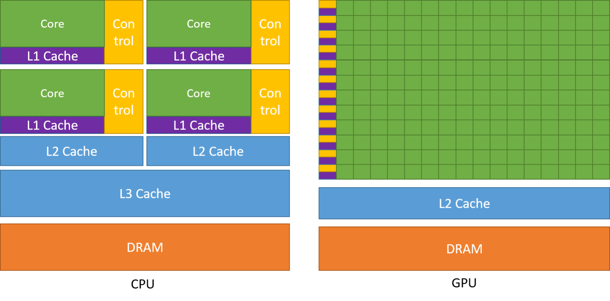
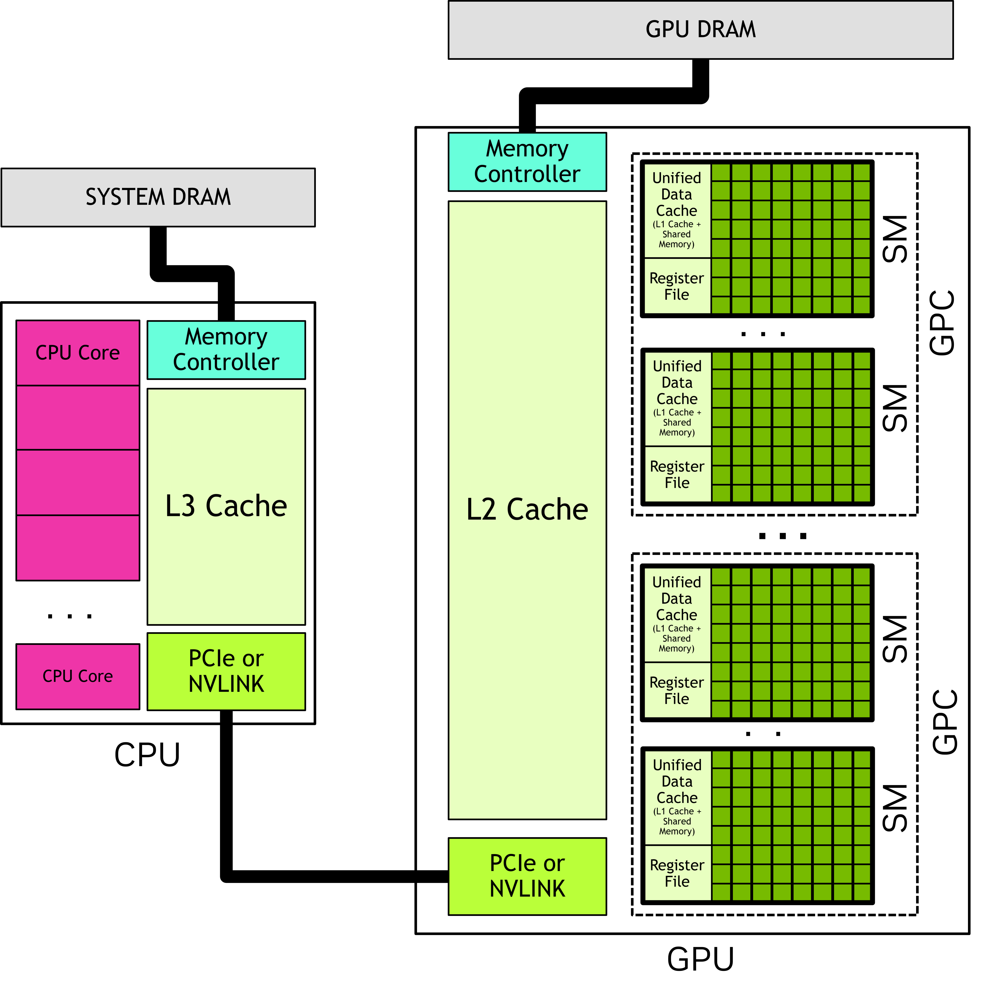
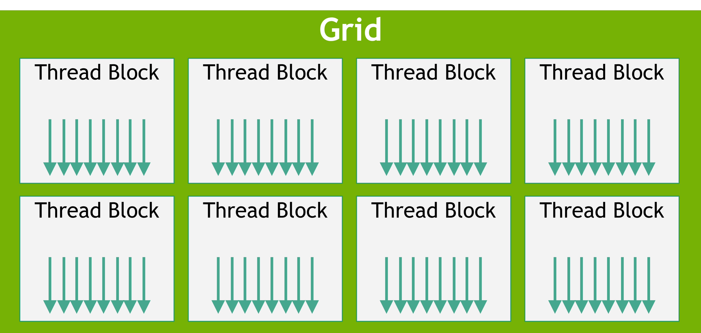
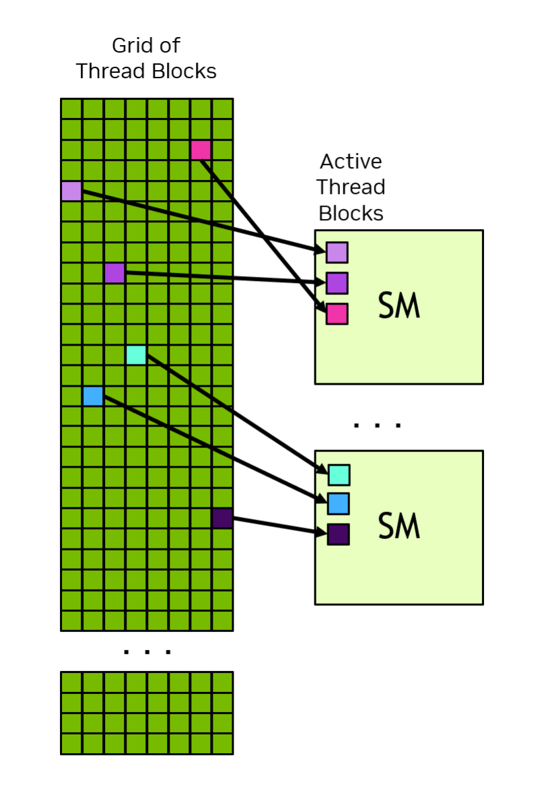
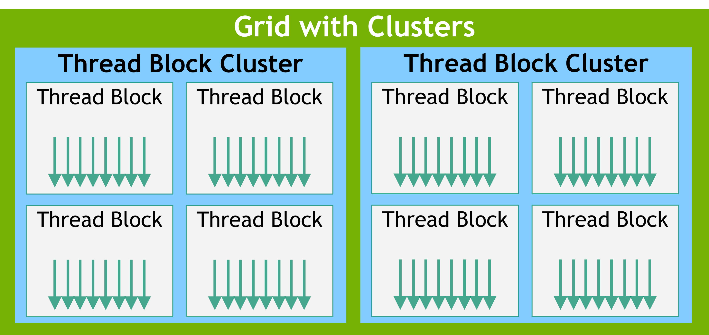
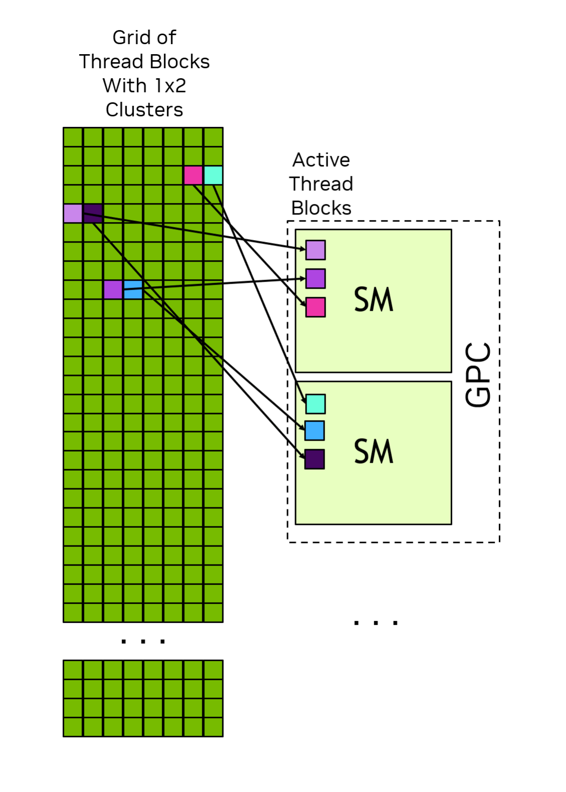
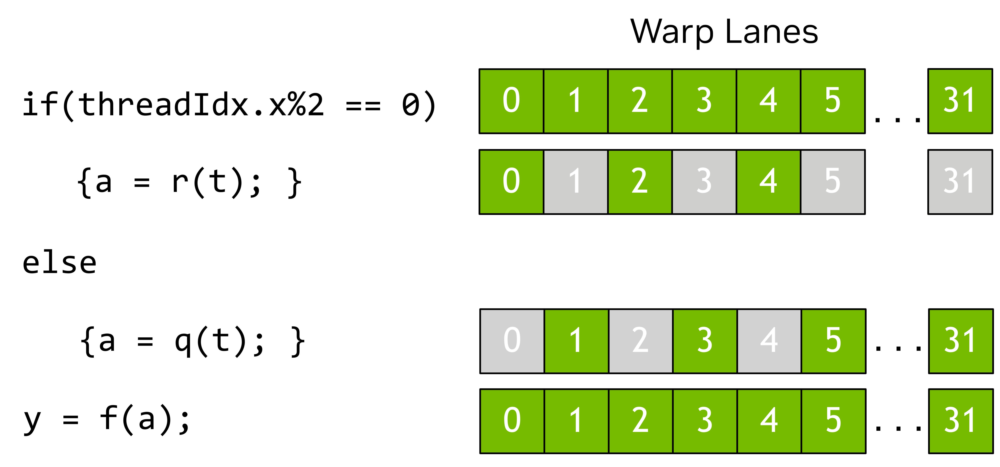
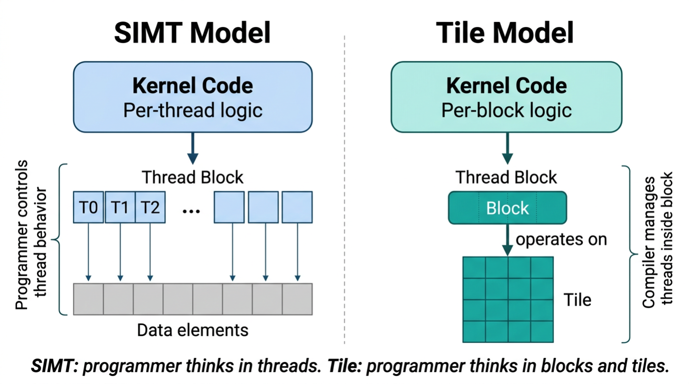
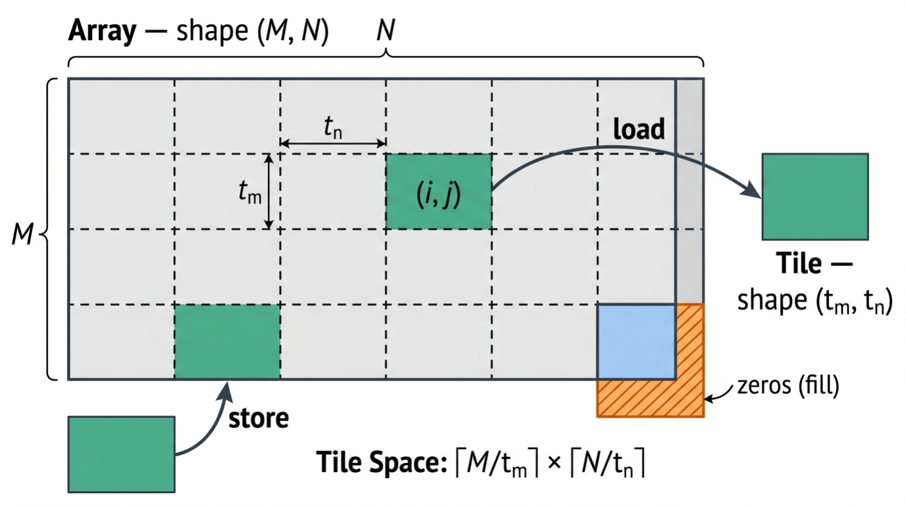

# 1 Introduction to CUDA 3

---

## Tabla de Contenidos

- [1 Introduction to CUDA 3](#1-introduction-to-cuda-3)
  - [Tabla de Contenidos](#tabla-de-contenidos)
  - [1.1 Introducción](#11-introducción)
    - [1.1.1 La unidad de procesamiento gráfico (GPU)](#111-la-unidad-de-procesamiento-gráfico-gpu)
    - [1.1.2 Las ventajas de usar GPUs](#112-las-ventajas-de-usar-gpus)
    - [1.1.3 Introducción rápida](#113-introducción-rápida)
  - [1.2 Modelo de programación](#12-modelo-de-programación)
    - [1.2.1 Sistemas heterogéneos](#121-sistemas-heterogéneos)
    - [1.2.2 Modelo de hardware de la GPU](#122-modelo-de-hardware-de-la-gpu)
      - [1.2.2.1 Bloques de hilos y cuadrículas](#1221-bloques-de-hilos-y-cuadrículas)
        - [1.2.2.1.1 Clústeres de bloques de hilos](#12211-clústeres-de-bloques-de-hilos)
      - [1.2.2.2 Warps y SIMT](#1222-warps-y-simt)
      - [1.2.2.3 Programación por mosaicos en CUDA](#1223-programación-por-mosaicos-en-cuda)
        - [1.2.2.3.1 Arrays y tiles](#12231-arrays-y-tiles)
        - [1.2.2.3.2 Espacio de tiles y movimiento de datos](#12232-espacio-de-tiles-y-movimiento-de-datos)
        - [1.2.2.3.3 Operaciones en tiles](#12233-operaciones-en-tiles)
        - [1.2.2.3.4 Relación con la programación SIMT](#12234-relación-con-la-programación-simt)
    - [1.2.3 Memoria de la GPU](#123-memoria-de-la-gpu)
      - [1.2.3.1 Memoria DRAM en sistemas heterogéneos](#1231-memoria-dram-en-sistemas-heterogéneos)
      - [1.2.3.2 Dominios de localidad](#1232-dominios-de-localidad)
      - [1.2.3.3 Memoria en chip en las GPU](#1233-memoria-en-chip-en-las-gpu)
      - [1.2.3.4 Memoria unificada](#1234-memoria-unificada)
  - [1.3 La plataforma CUDA](#13-la-plataforma-cuda)
    - [1.3.1 Capacidad de cómputo y versiones de multiprocesadores en streaming](#131-capacidad-de-cómputo-y-versiones-de-multiprocesadores-en-streaming)
    - [1.3.2 Kit de herramientas CUDA y controlador NVIDIA](#132-kit-de-herramientas-cuda-y-controlador-nvidia)
      - [1.3.2.1 API de tiempo de ejecución de CUDA y API del controlador de CUDA](#1321-api-de-tiempo-de-ejecución-de-cuda-y-api-del-controlador-de-cuda)
    - [1.3.3 Ejecución paralela de hilos (PTX)](#133-ejecución-paralela-de-hilos-ptx)
    - [1.3.4 Cubins y Fatbins](#134-cubins-y-fatbins)
      - [1.3.4.1 Compatibilidad binaria](#1341-compatibilidad-binaria)
      - [1.3.4.2 Compatibilidad con PTX](#1342-compatibilidad-con-ptx)
      - [1.3.4.3 Compilación justo a tiempo](#1343-compilación-justo-a-tiempo)
      - [1.3.4.4 Finalización de binarios](#1344-finalización-de-binarios)

---

## 1.1 Introducción

### 1.1.1 La unidad de procesamiento gráfico (GPU)

Creada como un procesador de propósito específico para gráficos 3D, la _Unidad de Procesamiento Gráfico_ (GPU) comenzó como un hardware de función fija para acelerar operaciones paralelas en el renderizado 3D en tiempo real. A lo largo de sucesivas generaciones, las GPU se volvieron más programables. Para 2003, algunas etapas del proceso de procesamiento gráfico se volvieron totalmente programables, ejecutando código personalizado en paralelo para cada componente de una escena 3D o una imagen.

En 2006, NVIDIA presentó la _Compute Unified Device Architecture_ (CUDA) para permitir que cualquier carga de trabajo computacional aprovechara la capacidad de rendimiento de las GPU, independientemente de las API gráficas.

Desde entonces, CUDA y la computación en GPU se han utilizado para acelerar cargas de trabajo computacionales de casi todo tipo, desde simulaciones científicas —como la dinámica de fluidos o el transporte de energía— hasta aplicaciones empresariales, como bases de datos y análisis de datos. Además, la capacidad y la programabilidad de las GPU han sido fundamentales para el avance de nuevos algoritmos y tecnologías que van desde la clasificación de imágenes hasta la inteligencia artificial generativa, como la difusión o los modelos de lenguaje a gran escala.

### 1.1.2 Las ventajas de usar GPUs

Una GPU ofrece un rendimiento de instrucciones y un ancho de banda de memoria mucho mayores que una CPU, dentro de un rango similar de precio y consumo energético. Muchas aplicaciones aprovechan estas capacidades para ejecutarse significativamente más rápido en la GPU que en la CPU (véase [Aplicaciones de GPU](https://nvidia.com/en-us/accelerated-applications/)). Otros dispositivos de cómputo, como los FPGA, también son muy eficientes en cuanto al consumo de energía, pero ofrecen mucha menos flexibilidad de programación que las GPU.

Las GPU y las CPU están diseñadas con objetivos diferentes. Mientras que una CPU está diseñada para destacar en la ejecución de una secuencia en serie de operaciones (denominada “hilo”) lo más rápido posible y puede ejecutar unas pocas decenas de estos hilos en paralelo, una GPU está diseñada para destacar en la ejecución de miles de hilos en paralelo, sacrificando un menor rendimiento por hilo para lograr un rendimiento total mucho mayor.

Las GPU están diseñadas para realizar cálculos altamente paralelos y dedican más transistores a las unidades de procesamiento de datos, mientras que las CPU dedican más transistores al almacenamiento en caché de datos y al control de flujo. La [Figura 1](#fig001) muestra un ejemplo de la distribución de los recursos del chip entre una CPU y una GPU.

> 
> 
> **Figura 1:** La GPU dedica más transistores al procesamiento de datos

### 1.1.3 Introducción rápida

Existen muchas formas de aprovechar la potencia de cálculo que ofrecen las GPU. Esta guía aborda la programación para la plataforma de GPU CUDA en lenguajes de alto nivel, como C++. Sin embargo, hay muchas maneras de utilizar las GPU en aplicaciones que no requieren escribir código directamente para la GPU.

A través de bibliotecas especializadas, se encuentra disponible una colección cada vez mayor de algoritmos y rutinas de diversos ámbitos. Cuando ya se ha implementado una biblioteca —especialmente las que ofrece NVIDIA—, usarla suele ser más productivo y eficiente que reimplementar algoritmos desde cero. Bibliotecas como cuBLAS, cuFFT, cuDNN y CUTLASS son solo algunos ejemplos de bibliotecas que ayudan a los desarrolladores a evitar reimplementar algoritmos ya consolidados. Estas bibliotecas tienen la ventaja adicional de estar optimizadas para cada arquitectura de GPU, lo que brinda una combinación ideal de productividad, rendimiento y portabilidad.

También existen marcos de trabajo, en particular los utilizados para la inteligencia artificial, que proporcionan componentes básicos acelerados por GPU. Muchos de estos marcos logran su aceleración al aprovechar las bibliotecas aceleradas por GPU mencionadas anteriormente.

Además, los lenguajes específicos de dominio (DSL), como Warp de NVIDIA o Triton de OpenAI, se compilan para ejecutarse directamente en la plataforma CUDA. Esto ofrece un método de programación de GPU de un nivel aún más elevado que los lenguajes de alto nivel que se tratan en esta guía.

El [Centro de computación acelerada de NVIDIA](https://github.com/NVIDIA/accelerated-computing-hub) contiene recursos, ejemplos y tutoriales para aprender sobre la computación con GPU y CUDA.

## 1.2 Modelo de programación

Este capítulo presenta el modelo de programación de CUDA a un nivel general y sin referir a ningún lenguaje en particular. La terminología y los conceptos que aquí se presentan se aplican a CUDA en cualquier lenguaje de programación compatible. En capítulos posteriores se ilustrarán estos conceptos en C++.

### 1.2.1 Sistemas heterogéneos

El modelo de programación CUDA parte de la base de un sistema de cómputo heterogéneo, es decir, un sistema que incluye tanto GPU como CPU. La CPU y la memoria conectada directamente a ella se denominan _host_ y _memoria del host_, respectivamente. Una GPU y la memoria conectada directamente a ella se denominan _dispositivo_ y _memoria del dispositivo_, respectivamente. En algunos sistemas en chip (SoC), estos pueden formar parte de un solo paquete. En sistemas más grandes, puede haber varias CPU o GPU.

Las aplicaciones CUDA ejecutan parte de su código en la GPU, pero siempre comienzan la ejecución en la CPU. El código del host, que es el que se ejecuta en la CPU, puede utilizar las API de CUDA para copiar datos entre la memoria del host y la memoria del dispositivo, iniciar la ejecución del código en la GPU y esperar a que se completen las copias de datos o el código de la GPU. Tanto la CPU como la GPU pueden ejecutar código simultáneamente, y por lo general se obtiene el mejor rendimiento al maximizar la utilización tanto de las CPU como de las GPU.

El código que una aplicación ejecuta en la GPU se conoce como _código de dispositivo_, y una función que se invoca para su ejecución en la GPU se denomina, por razones históricas, _kernel_. El acto de iniciar la ejecución de un kernel se denomina _lanzamiento_ del kernel. Se puede considerar que el lanzamiento de un kernel consiste en iniciar muchos hilos que ejecutan el código del kernel en paralelo en la GPU. Los hilos de la GPU funcionan de manera similar a los hilos de las CPU, aunque existen algunas diferencias importantes tanto para la corrección como para el rendimiento que se tratarán en secciones posteriores (véase [Sección 3.2.2.1.1](./chapter03.md#32211-programación-independiente-de-hilos)).

### 1.2.2 Modelo de hardware de la GPU

Al igual que cualquier modelo de programación, CUDA se basa en un modelo conceptual del hardware subyacente. A efectos de la programación con CUDA, la GPU puede considerarse como un conjunto de _multiprocesadores de flujo_ (SM) organizados en grupos denominados _clústeres de procesamiento gráfico_ (GPC). Cada SM contiene un archivo de registros local, una caché de datos unificada y varias unidades funcionales que realizan cálculos. La caché de datos unificada proporciona los recursos físicos para la _memoria compartida_ y la caché L1. La asignación de la caché de datos unificada a la caché L1 y a la memoria compartida se puede configurar en tiempo de ejecución. Los tamaños de los diferentes tipos de memoria y el número de unidades funcionales dentro de un SM pueden variar según las arquitecturas de la GPU.

> [!NOTE]
> La disposición real del hardware de una GPU o la forma en que lleva a cabo físicamente la ejecución del modelo de programación puede variar. Estas diferencias no afectan la corrección del software escrito utilizando el modelo de programación CUDA.
>
> 
> 
> **Figura 2:** Una GPU cuenta con numerosos multiprocesadores de flujo (SM), cada uno de los cuales contiene muchas unidades funcionales. Los clústeres de procesamiento gráfico (GPC) son conjuntos de SM. Una GPU es un conjunto de GPC conectados a la memoria de la GPU. Una CPU suele tener varios núcleos y un controlador de memoria que se conecta a la memoria del sistema. Una CPU y una GPU están conectadas mediante una interconexión como PCIe o NVLINK.

#### 1.2.2.1 Bloques de hilos y cuadrículas

Cuando una aplicación inicia un kernel, lo hace con muchos _hilos_, a menudo millones de hilos. Estos hilos se organizan en bloques. Un bloque de hilos se denomina, como es de esperarse, _bloque de hilos_. Los bloques de hilos se organizan en una _cuadrícula_. Todos los bloques de hilos de una cuadrícula tienen el mismo tamaño y las mismas dimensiones. La [Figura 3](#fig003) muestra una ilustración de una cuadrícula de bloques de hilos.

> 
> 
> **Figura 3:** Cuadrícula de bloques de hilos. Cada flecha representa un hilo (el número de flechas no refleja el número real de hilos).

Los bloques de hilos y las cuadrículas pueden ser de 1, 2 o 3 dimensiones. Estas dimensiones pueden simplificar la asignación de hilos individuales a unidades de trabajo o elementos de datos.

Cuando se inicia un kernel, se hace mediante una _configuración de ejecución_ específica que especifica las dimensiones de la cuadrícula y del bloque de hilos. La configuración de ejecución también puede incluir parámetros opcionales, como el tamaño del clúster, el flujo y los ajustes de configuración del SM, que se presentarán en secciones posteriores.

Mediante variables integradas, cada hilo que ejecuta el kernel puede determinar su ubicación dentro del bloque que lo contiene y la ubicación de su bloque dentro de la cuadrícula que lo contiene. Un hilo también puede utilizar estas variables integradas para determinar las dimensiones de los bloques de hilos y de la cuadrícula en la que se lanzó el kernel. Esto le da a cada hilo una identidad única entre todos los hilos que ejecutan el kernel. Esta identidad se utiliza con frecuencia para determinar de qué datos u operaciones es responsable un hilo.

Todos los hilos de un bloque de hilos se ejecutan en un solo SM. Esto permite que los hilos dentro de un bloque de hilos se comuniquen y se sincronicen entre sí de manera eficiente. Todos los hilos dentro de un bloque de hilos tienen acceso a la memoria compartida en el chip, la cual se puede utilizar para intercambiar información entre los hilos de un bloque de hilos.

Una cuadrícula puede estar compuesta por millones de bloques de hilos, mientras que la GPU que ejecuta la cuadrícula puede tener solo decenas o cientos de SM. Todos los hilos de un bloque de hilos son ejecutados por un solo SM y, en la mayoría de los casos [^1], se ejecutan hasta su finalización en ese SM. No hay garantía de programación entre bloques de hilos, por lo que un bloque de hilos no puede depender de los resultados de otros bloques de hilos, ya que es posible que estos no puedan programarse hasta que ese bloque de hilos haya finalizado. La [Figura 4](#fig004) muestra un ejemplo de cómo se asignan los bloques de hilos de una cuadrícula a un SM.

[^1]: En ciertas situaciones, al utilizar características como el [_Paralelismo dinámico de CUDA_](./chapter04.md#420-paralelismo-dinámico-de-cuda), un bloque de hilos puede suspenderse en memoria. Esto significa que el estado del SM se almacena en un área de la memoria de la GPU administrada por el sistema y el SM queda libre para ejecutar otros bloques de hilos. Esto es similar al intercambio de contexto en las CPU. No es algo común.

> 
> 
> **Figura 4:** Cada SM tiene uno o más bloques de hilos activos. En este ejemplo, cada SM tiene tres bloques de hilos programados simultáneamente. No hay garantías sobre el orden en que los bloques de hilos de una cuadrícula se asignan a los SM.

El modelo de programación CUDA permite que se ejecuten cuadrículas de tamaño arbitrariamente grande en GPU de cualquier tamaño, ya sea que cuenten con un solo SM o con miles de SM. Para lograrlo, el modelo de programación CUDA, con algunas excepciones, requiere que no haya dependencias de datos entre hilos de diferentes bloques de hilos. Es decir, un hilo no debe depender de los resultados de un hilo de otro bloque de hilos de la misma cuadrícula ni sincronizarse con él. Todos los hilos dentro de un bloque de hilos se ejecutan en el mismo SM al mismo tiempo. Los diferentes bloques de hilos dentro de la cuadrícula se programan entre los SM disponibles y pueden ejecutarse en cualquier orden. En resumen, el modelo de programación de CUDA requiere que sea posible ejecutar bloques de hilos en cualquier orden, ya sea en paralelo o en serie.

##### 1.2.2.1.1 Clústeres de bloques de hilos

Además de los bloques de hilos, las GPU con capacidad de cómputo 9.0 y superior cuentan con un nivel opcional de agrupación denominado _clústeres_. Los clústeres son un grupo de bloques de hilos que, al igual que los bloques de hilos y las cuadrículas, pueden disponerse en 1, 2 o 3 dimensiones. La [Figura 5](#fig005) ilustra una cuadrícula de bloques de hilos que también está organizada en clústeres. Especificar clústeres no cambia las dimensiones de la cuadrícula ni los índices de un bloque de hilos dentro de una cuadrícula.

> 
> 
> **Figura 5:** Cuando se especifican clústeres, los bloques de hilos se encuentran en la misma ubicación dentro de la cuadrícula, pero también tienen una posición dentro del clúster que los contiene.

Al especificar clústeres, los bloques de hilos adyacentes se agrupan en clústeres, lo que ofrece algunas oportunidades adicionales para la sincronización y la comunicación a nivel de clúster. Específicamente, todos los bloques de hilos de un clúster se ejecutan en un solo GPC. La [Figura 6](#fig006) muestra cómo se programan los bloques de hilos en los SM de un GPC cuando se especifican clústeres. Debido a que los bloques de hilos se programan simultáneamente y dentro de un solo GPC, los hilos de diferentes bloques, pero que se encuentran dentro del mismo clúster, pueden comunicarse y sincronizarse entre sí utilizando las interfaces de software proporcionadas por [_Grupos Cooperativos_](./chapter02.md#236-grupos-cooperativos). Los hilos de los clústeres pueden acceder a la memoria compartida de todos los bloques del clúster, lo que se conoce como [_memoria compartida distribuida_](./chapter02.md#2338-memoria-compartida-distribuida). El tamaño máximo de un clúster depende del hardware y varía entre dispositivos.

> 
> 
> **Figura 6:** Cuando se especifican clústeres, los bloques de hilos de un clúster se organizan según la forma del clúster dentro de la cuadrícula. Los bloques de hilos de un clúster se programan simultáneamente en los SM de un solo GPC.

La [Figura 6](#fig006) ilustra cómo los bloques de hilos dentro de un clúster se programan simultáneamente en los SM dentro de un GPC. Los bloques de hilos dentro de un clúster siempre están adyacentes entre sí dentro de la cuadrícula.

#### 1.2.2.2 Warps y SIMT

Dentro de un bloque de hilos, los hilos se organizan en grupos de 32 hilos llamados _warps_. Un warp ejecuta el código del kernel siguiendo el paradigma _Single-Instruction Multiple-Threads_ (SIMT). En SIMT, todos los hilos del warp ejecutan el mismo código del kernel, pero cada hilo puede seguir diferentes ramificaciones a lo largo del código. Es decir, aunque todos los hilos del programa ejecutan el mismo código, no es necesario que sigan la misma ruta de ejecución.

Cuando un warp ejecuta hilos, a estos se les asigna un carril de warp. Los carriles de warp están numerados del 0 al 31 y los hilos de un bloque de hilos se asignan a los warps de una manera predecible, tal como se detalla en [_Multihilo de hardware_](./chapter03.md#3222-multithreading-en-hardware).

Todos los hilos del warp ejecutan la misma instrucción simultáneamente. Si algunos hilos dentro de un warp siguen una ramificación del flujo de control durante la ejecución, mientras que otros no, los hilos que no siguen la ramificación quedarán enmascarados mientras se ejecutan los hilos que sí la siguen. Por ejemplo, si una condición solo es verdadera para la mitad de los hilos de un warp, la otra mitad del warp quedaría enmascarada mientras los hilos activos ejecutan esas instrucciones. Esta situación se ilustra en la [Figura 7](#fig007). Cuando diferentes hilos de un warp siguen diferentes rutas de código, esto a veces se denomina divergencia de warp. De ello se deduce que la utilización de la GPU se maximiza cuando los hilos dentro de un warp siguen la misma ruta de flujo de control.

> 
> 
> **Figura 7:** En este ejemplo, solo los hilos con índice par ejecutan el cuerpo de la instrucción `if`; los demás quedan en espera mientras se ejecuta el cuerpo.

En el modelo SIMT, todos los hilos de un warp avanzan por el kernel al unísono. La ejecución en el hardware puede variar. Consulta las secciones sobre [_Ejecución independiente de hilos_](./chapter03.md#32211-programación-independiente-de-hilos) para obtener más información sobre en qué casos esta distinción es importante. No se recomienda aprovechar el conocimiento de cómo se mapea realmente la ejecución del warp al hardware real. El modelo de programación de CUDA y el SIMT establecen que todos los hilos de un warp avanzan juntos por el código. El hardware puede optimizar los carriles enmascarados de formas transparentes para el programa, siempre y cuando se respete el modelo de programación. Si el programa incumple este modelo, puede dar lugar a un comportamiento indefinido que puede variar según el hardware de la GPU.

Si bien no es necesario tomar en cuenta los warps al escribir código CUDA, comprender el modelo de ejecución de los warps es útil para entender conceptos como la [_fusión de memoria global_](./chapter02.md#2341-acceso-a-la-memoria-global-en-secuencia) y los [_patrones de acceso a bancos de memoria compartida_](./chapter02.md#2342-patrones-de-acceso-a-la-memoria-compartida). Algunas técnicas avanzadas de programación utilizan la especialización de warps dentro de un bloque de hilos para limitar la divergencia de hilos y maximizar la utilización. Esta y otras optimizaciones aprovechan el hecho de que los hilos se agrupan en warps durante la ejecución.

Una consecuencia de la ejecución por warps es que lo ideal es especificar los bloques de hilos con un número total de hilos que sea múltiplo de 32. Es válido utilizar cualquier número de hilos, pero cuando el total no es múltiplo de 32, el último warp del bloque de hilos tendrá algunos carriles que permanecerán sin usar durante toda la ejecución. Esto probablemente provocará una utilización subóptima de las unidades funcionales y del acceso a la memoria para ese warp.

> El SIMT se compara a menudo con el paralelismo de «una instrucción, múltiples datos» (SIMD), pero existen algunas diferencias importantes. En SIMD, la ejecución sigue una única ruta de flujo de control, mientras que en SIMT, cada hilo puede seguir su propia ruta de flujo de control. Debido a esto, SIMT no tiene un ancho de datos fijo como SIMD. Se puede encontrar una explicación más detallada sobre SIMT en [Modelo de ejecución SIMT](./chapter03.md#3221-modelo-de-ejecución-simt).

#### 1.2.2.3 Programación por mosaicos en CUDA

Además del modelo SIMT descrito en las secciones anteriores, CUDA también soporta un modelo de programación basado en "tiles". En la programación basada en tiles, el programador escribe código a nivel de un bloque completo de hilos, describiendo operaciones sobre colecciones multidimensionales de datos llamadas **tiles**. El compilador mapea estas operaciones a los hilos individuales del bloque.

Los kernels basados en tiles se lanzan en una cuadrícula de bloques, como se describe en la sección [Bloques de hilos y cuadrículas](#1221-bloques-de-hilos-y-cuadrículas). Cada bloque ejecuta el kernel basado en tiles y puede consultar su posición dentro de la cuadrícula para determinar qué porción de los datos es responsable. El programador especifica únicamente las dimensiones de la cuadrícula; el número de hilos por bloque se determina por el compilador en función de las operaciones del kernel ([Figura 8](#fig008)).

> 
> 
> **Figura 8:** Vista del programador en los modelos SIMT y de programación basada en tiles. En SIMT, el programador escribe código por hilo y controla cómo cada hilo accede a los datos. En la programación basada en tiles, el programador escribe código por bloque que opera sobre tiles; el compilador mapea las operaciones a los hilos del bloque.

Dentro de un kernel basado en tiles, un solo bloque ejecuta un flujo de control. El programador especifica operaciones sobre tiles, y el compilador distribuye el trabajo entre los hilos del bloque. Se admiten las estructuras de control estándar, como las condiciones y los bucles, pero dado que el bloque sigue un solo flujo de control, no existe el concepto de divergencia de warp. Las operaciones escalares, como calcular un índice o un límite de bucle, se ejecutan en un solo hilo del bloque. Las operaciones basadas en tiles, como sumar dos tiles elemento por elemento, se ejecutan en paralelo por todos los hilos del bloque.

Es importante no confundir los bloques (unidades de ejecución) con los tiles (unidades de datos). Un solo bloque puede crear y operar sobre muchos tiles de diferentes formas y tipos de datos.

##### 1.2.2.3.1 Arrays y tiles

Los kernels basados en tiles trabajan con dos tipos de datos: **arrays** y **tiles**. Un array (o array global) es un contenedor multidimensional de elementos almacenados en la memoria del dispositivo. Los arrays son mutables: su contenido puede ser modificado mediante operaciones de almacenamiento dentro de un kernel. Un array tiene una forma y un tipo de datos.

Un tile es una colección multidimensional de valores que existe únicamente en el código del tile y es local a un solo bloque. Los tiles son inmutables: cada operación en un tile produce un nuevo tile en lugar de modificar uno existente. A diferencia de un array, un tile no necesariamente tiene una representación en la memoria: el compilador decide cómo se almacena los datos del tile, y puede utilizar registros, memoria compartida u otros recursos del SM. Cada dimensión de un tile debe ser una potencia de dos y debe ser conocida en tiempo de compilación (es decir, su valor debe ser determinable antes de que se ejecute el kernel, en lugar de calcularse durante la ejecución). Los tiles no pueden pasarse como parámetros del kernel; se crean y consumen completamente dentro del código del tile.

##### 1.2.2.3.2 Espacio de tiles y movimiento de datos

Los datos se mueven entre arrays y tiles a través de operaciones de carga y almacenamiento. Estas operaciones utilizan un concepto llamado **espacio de tiles**, que es el resultado de particionar conceptualmente un array en tiles de tamaño igual y no superpuestos. Por ejemplo, considere un array bidimensional de forma $(M, N)$. Si una operación de carga especifica una forma de tile de $(t_m, t_n)$, el array se divide conceptualmente en $\lceil M/t_m \rceil$ filas y $\lceil N/t_n \rceil$ columnas de tiles. Un índice en este espacio de tiles, como $(i, j)$, identifica qué tile se debe cargar. La carga devuelve un tile de forma $(t_m, t_n)$ que contiene los elementos correspondientes del array. Cuando un tile se extiende más allá de los límites del array, por ejemplo, en los bordes cuando las dimensiones del array no son múltiplos exactos de las dimensiones del tile, la carga especifica cómo se manejan los elementos fuera de los límites, como rellenándolos con ceros ([Figura 9](#fig009)).

> 
> 
> **Figura 9:** Espacio de tiles y movimiento de datos. Un array bidimensional de forma $(M, N)$ se particiona conceptualmente en una cuadrícula de tiles con forma $(t_m, t_n)$. Una carga en el índice del espacio de tiles $(i, j)$ devuelve el tile correspondiente. En el límite del array, los elementos que caen fuera del array pueden rellenarse con ceros. Una operación de almacenamiento escribe un tile de vuelta al array en un índice del espacio de tiles dado.

Una operación de almacenamiento realiza lo inverso: dado un tile y un índice en el espacio de tiles, escribe los elementos del tile en la región correspondiente del array. Cualquier escritura que caiga fuera de los límites del array se descarta silenciosamente. Los programas de tile también admiten operaciones de recopilación y dispersión, que cargan desde o almacenan en posiciones arbitrarias en un array.

##### 1.2.2.3.3 Operaciones en tiles

Los programas de tile proporcionan un conjunto de operaciones incorporadas que actúan sobre los tiles, que incluyen operaciones aritméticas elemento por elemento, multiplicación de matrices, reducciones (como suma y máximo) a lo largo de un o más ejes, manipulación de formas (como reshape y transpose) y conversión de tipos. Cuando se combinan dos tiles de diferentes formas en una operación, el tile más pequeño se expande automáticamente para que coincida con el más grande antes de que se aplique la operación.

##### 1.2.2.3.4 Relación con la programación SIMT

La programación basada en tiles y la programación SIMT coexisten en CUDA. Una aplicación puede contener kernels tanto SIMT como de tile, y ambos tipos de kernels pueden operar en los mismos datos en la memoria del dispositivo. La elección del modelo de programación es una decisión por kernel. La programación basada en tiles no reemplaza la programación SIMT. SIMT proporciona un control más fino sobre los hilos individuales, lo que sigue siendo necesario para algunos algoritmos y técnicas de optimización. La programación basada en tiles proporciona una abstracción de nivel superior que puede simplificar el desarrollo de kernels. Debido a que las decisiones a nivel de hilo se dejan al compilador, el mismo kernel basado en tiles puede ejecutarse en diferentes arquitecturas de GPU sin requerir cambios en el código fuente. Ambos modelos se basan en el mismo hardware subyacente: SMs, bloques de hilos y grids, que se describen en las secciones anteriores. Ambos modelos también utilizan los mismos espacios de memoria del dispositivo, que se introducen en la siguiente sección.

### 1.2.3 Memoria de la GPU

En los sistemas de computación modernos, el uso eficiente de la memoria es tan importante como la maximización del uso de las unidades funcionales que realizan cálculos. Los sistemas heterogéneos tienen múltiples espacios de memoria, y las GPUs contienen varios tipos de memoria on-chip programables además de las cachés. Las siguientes secciones introducen estos espacios de memoria con más detalle.

#### 1.2.3.1 Memoria DRAM en sistemas heterogéneos

Las GPUs y las CPUs tienen chips de DRAM directamente conectados. En sistemas con más de una GPU, cada GPU tiene su propia memoria. Desde la perspectiva del código del dispositivo, el DRAM conectado a la GPU se denomina _memoria global_, ya que es accesible para todos los SM (Streaming Multiprocessor) en la GPU. Este término no significa necesariamente que sea accesible en todas partes dentro del sistema. El DRAM conectado a la CPU(s) se denomina _memoria del sistema_ o _memoria del host_.

Al igual que las CPUs, las GPUs utilizan la memoria virtual. En todos los sistemas actualmente soportados, la CPU y la GPU utilizan un único espacio de memoria virtual unificado. Esto significa que el rango de direcciones de memoria virtual para cada GPU en el sistema es único y distinto del CPU y de todas las demás GPUs en el sistema. Para una dirección de memoria virtual dada, es posible determinar si esa dirección está en la memoria de la GPU o en la memoria del sistema, y, en sistemas con múltiples GPUs, qué GPU contiene esa dirección.

Existen APIs de CUDA para asignar memoria de GPU, memoria de CPU y para copiar entre asignaciones en la CPU, dentro de la GPU, o entre GPUs en sistemas multi-GPU. La localidad de los datos puede ser controlada explícitamente cuando se desee. [Memoria unificada](#1234-memoria-unificada), que se discute a continuación, permite que la ubicación de la memoria sea gestionada automáticamente por el runtime de CUDA o por el hardware del sistema.

#### 1.2.3.2 Dominios de localidad

Un _dominio de localidad_ es un subconjunto de la memoria y los _Streaming Multiprocessors (SMs)_ de una GPU. Todas las GPUs tienen al menos un dominio de localidad. Las GPUs más grandes pueden tener más de un dominio de localidad. En GPUs con más de un dominio de localidad, el rendimiento de algunos kernels puede mejorarse utilizando memoria y computación _localizadas_. La _memoria localizada_ es una asignación de memoria que se encuentra completamente dentro de un único dominio de localidad. Los kernels que utilizan esta memoria pueden ser programados en los SMs dentro del mismo dominio de localidad. Las aplicaciones se benefician de la localización cuando la memoria y la computación se dividen entre los dominios de localidad y se puede emitir trabajo a cada dominio de localidad en paralelo.

La memoria de la GPU que se asigna sin especificar un dominio de localidad se denomina _no localizada_. Las asignaciones de memoria no localizada abarcan varios dominios de localidad, excepto en el caso de asignaciones muy pequeñas.

En GPUs con un único dominio de localidad, todos los SMs y la memoria de la GPU son parte de ese único dominio de localidad.

La [sección 4.7](./chapter04.md#47-dominios-de-localidad) muestra los mecanismos para localizar la memoria y la computación de la GPU dentro de un dominio de localidad específico. Los dominios de localidad son una característica de rendimiento: el código CUDA que no localiza la memoria o la computación seguirá ejecutándose correctamente.

#### 1.2.3.3 Memoria en chip en las GPU

Además de la memoria global, cada GPU tiene cierta memoria integrada. Cada SM (Streaming Multiprocessor) tiene su propio archivo de registros y memoria compartida. Estas memorias son parte del SM y pueden ser accedidas extremadamente rápidamente por los hilos que ejecutan dentro del SM.

El archivo de registros almacena variables locales de hilos, que generalmente son asignadas por el compilador. La memoria compartida es accesible para todos los hilos dentro de un bloque o grupo de hilos. La memoria compartida se puede utilizar para intercambiar datos entre hilos de un bloque o grupo de hilos.

El archivo de registros y la caché unificada en un SM tienen tamaños finitos. El tamaño del archivo de registros, la caché unificada, y la configuración de la caché unificada para equilibrar entre L1 y memoria compartida se pueden encontrar en [Información de memoria por capacidad de cómputo](./chapter05.md#513-características-y-especificaciones-técnicas). El archivo de registros, el espacio de memoria compartida y la caché L1 se comparten entre todos los hilos de un bloque de hilos.

Para programar un bloque de hilos en un SM, el número total de registros necesarios para cada hilo multiplicado por el número de hilos en el bloque de hilos debe ser menor o igual a los registros disponibles en el SM. Si el número de registros requeridos para un bloque de hilos excede el tamaño del archivo de registros, el kernel no es lanzable y el número de hilos en el bloque de hilos debe disminuirse para que el bloque de hilos sea lanzable.

Las asignaciones de memoria compartida se realizan a nivel de bloque de hilos. Es decir, a diferencia de las asignaciones de registros, que son por hilo, las asignaciones de memoria compartida son comunes para todo el bloque de hilos.

#### 1.2.3.4 Memoria unificada

Cuando una aplicación asigna memoria explícitamente en la GPU o en la CPU, esa memoria solo es accesible desde el código que se ejecuta en ese dispositivo. Es decir, la memoria de la CPU solo puede ser accedida desde el código de la CPU, y la memoria de la GPU solo puede ser accedida desde los kernels que se ejecutan en la GPU[^2]. Las APIs de CUDA para copiar memoria entre la CPU y la GPU se utilizan para copiar explícitamente los datos al lugar correcto en el momento adecuado.

[^2]: Una excepción a esto es [la memoria mapeada](./chapter02.md#2631-memoria-mapeada), que es memoria de la CPU asignada con propiedades que permiten su acceso directo desde la GPU. Sin embargo, el acceso mapeado se realiza a través de la conexión PCIe o NVLINK. La GPU no puede ocultar la mayor latencia y el menor ancho de banda detrás del paralelismo, por lo que la memoria mapeada no es un reemplazo eficiente para la memoria unificada o para colocar los datos en el espacio de memoria apropiado.

Una característica de CUDA llamada _memoria unificada_ permite a las aplicaciones realizar asignaciones de memoria que pueden ser accedidas desde la CPU o la GPU. El runtime de CUDA o el hardware subyacente habilitan el acceso o la reubicación de los datos al lugar correcto cuando sea necesario. Incluso con memoria unificada, el rendimiento óptimo se logra manteniendo la migración de la memoria al mínimo y accediendo a los datos desde el procesador directamente conectado al espacio de memoria donde residen.

Las características de hardware del sistema determinan cómo se logra el acceso y el intercambio de datos entre los espacios de memoria. La sección [Memoria Unificada](./chapter02.md#262-memoria-unificada) introduce las diferentes categorías de sistemas de memoria unificada. La sección [Memoria Unificada](./chapter04.md#41-memoria-unificada) contiene muchos más detalles sobre el uso y el comportamiento de la memoria unificada en todas las situaciones.

## 1.3 La plataforma CUDA

La plataforma NVIDIA CUDA consta de numerosos componentes de software y hardware, así como de importantes tecnologías desarrolladas para habilitar la computación en sistemas heterogéneos. Este capítulo tiene como objetivo introducir algunos de los conceptos y componentes fundamentales de la plataforma CUDA que son importantes para que los desarrolladores de aplicaciones los comprendan. Este capítulo, al igual que [Modelo de Programación](#12-modelo-de-programación), no está específico para ningún lenguaje de programación, sino que se aplica a todo lo que utiliza la plataforma CUDA.

### 1.3.1 Capacidad de cómputo y versiones de multiprocesadores en streaming

Cada GPU de NVIDIA tiene un número de _Compute Capability_ (CC), que indica qué características son compatibles con esa GPU y especifica algunos parámetros de hardware para esa GPU. Estas especificaciones están documentadas en el [apéndice 5.1](./chapter05.md#51-capacidades-de-computación). Una lista de todas las GPUs de NVIDIA y sus capacidades de computación se mantiene en la [página de capacidades de GPU de CUDA](https://developer.nvidia.com/cuda/gpus).

La capacidad de computación se denota como un número de versión mayor y menor en el formato X.Y, donde X es el número de versión mayor y Y es el número de versión menor. Por ejemplo, CC 12.0 tiene una versión mayor de 12 y una versión menor de 0. La capacidad de computación corresponde directamente a la versión del SM. Por ejemplo, los SM dentro de una GPU de CC 12.0 tienen la versión _sm_120_. Esta versión se utiliza para etiquetar los binarios.

[La sección 5.1.1](./chapter05.md#511-obtener-la-capacidad-de-la-gpu) muestra cómo consultar y determinar la capacidad de computación de la GPU(s) en un sistema.

### 1.3.2 Kit de herramientas CUDA y controlador NVIDIA

El _Driver NVIDIA_ puede ser considerado como el sistema operativo de la GPU. El Driver NVIDIA es un componente de software que debe instalarse en el sistema operativo del host y es necesaria para todas las funciones de la GPU, incluyendo la visualización y la funcionalidad gráfica. El Driver NVIDIA es fundamental para la plataforma CUDA. Además de CUDA, el Driver NVIDIA proporciona todos los demás métodos de uso de la GPU, por ejemplo Vulkan y Direct3D. El Driver NVIDIA tiene números de versión como r580.

El _CUDA Toolkit_ es un conjunto de bibliotecas, encabezados y herramientas para escribir, construir y analizar software que utiliza la computación en GPU. El CUDA Toolkit es un producto de software separado del driver de NVIDIA.

El _CUDA runtime_ es un caso especial de una de las bibliotecas proporcionadas por el CUDA Toolkit. El CUDA runtime proporciona tanto una API como algunas extensiones de lenguaje para manejar tareas comunes, como la asignación de memoria, la copia de datos entre GPUs y entre GPUs y CPUs, y el lanzamiento de kernels. Los componentes de la API del CUDA runtime se denominan API del CUDA runtime.

El documento [CUDA Compatibility](https://docs.nvidia.com/deploy/cuda-compatibility/latest/index.html) proporciona detalles completos de la compatibilidad entre diferentes GPUs, NVIDIA Drivers y versiones del CUDA Toolkit.

#### 1.3.2.1 API de tiempo de ejecución de CUDA y API del controlador de CUDA

The CUDA runtime API is implemented on top of a lower-level API called the _CUDA driver API_, which is an API exposed by the NVIDIA Driver. This guide focuses on the APIs exposed by the CUDA runtime API. All the same functionality can be achieved using only the driver API if desired. Some features are only available using the driver API. Applications may use either API or both interoperably. Section [The CUDA Driver API](./chapter03.md#33-la-api-del-controlador-cuda) covers interoperation between the runtime and driver APIs.

The full API reference for the CUDA runtime API functions can be found in the [CUDA Runtime API Documentation](https://docs.nvidia.com/cuda/cuda-runtime-api/index.html).

The full API reference for the CUDA driver API can be found in the CUDA Driver API Documentation .

### 1.3.3 Ejecución paralela de hilos (PTX)

### 1.3.4 Cubins y Fatbins

#### 1.3.4.1 Compatibilidad binaria

#### 1.3.4.2 Compatibilidad con PTX

#### 1.3.4.3 Compilación justo a tiempo

#### 1.3.4.4 Finalización de binarios
