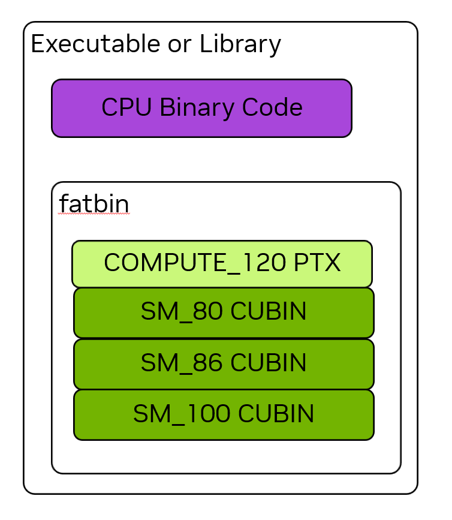

# 1.3. La plataforma CUDA

La plataforma NVIDIA CUDA consta de numerosos componentes de software y hardware, así como de importantes tecnologías desarrolladas para habilitar el procesamiento en sistemas heterogéneos. Este capítulo tiene como objetivo presentar algunos de los conceptos y componentes fundamentales de la plataforma CUDA que son importantes para que los desarrolladores de aplicaciones los comprendan. Al igual que el [Modelo de programación](programming-model[es].md#12-modelo-de-programación), este capítulo no está dirigido a ningún lenguaje de programación específico, sino que se aplica a todo lo que utiliza la plataforma CUDA.

## 1.3.1. Capacidad de cómputo y versiones con múltiples procesadores de flujo

Cada GPU de NVIDIA tiene un número de _Capacidad de cómputo_ (CC), que indica qué características son compatibles con esa GPU y especifica algunos parámetros de hardware para esa GPU. Estas especificaciones están documentadas en el apéndice [5.1](../05-appendices/compute-capabilities.md#51-compute-capabilities). Se mantiene una lista de todas las GPUs de NVIDIA y sus capacidades de cómputo en la página [de capacidades de cómputo de GPU CUDA](https://developer.nvidia.com/cuda-gpus).

La capacidad de cómputo se indica como un número de versión principal y secundario en el formato X.Y, donde X es el número de versión principal y Y es el número de versión secundario. Por ejemplo, CC 12.0 tiene una versión principal de 12 y una versión secundaria de 0. La capacidad de cómputo corresponde directamente al número de versión del SM. Por ejemplo, los SM dentro de una GPU con CC 12.0 tienen una versión de SM sm_120. Esta versión se utiliza para etiquetar los binarios.

La sección [5.1.1](../05-appendices/compute-capabilities.md#511-obtain-the-gpu-compute-capability) muestra cómo consultar y determinar la capacidad de cómputo de las GPU(s) en un sistema.

## 1.3.2. Herramienta CUDA y controlador NVIDIA

El _controlador NVIDIA_ puede considerarse como el sistema operativo de la GPU. El controlador NVIDIA es un componente de software que debe instalarse en el sistema operativo del host y es necesario para todas las funciones de la GPU, incluyendo la visualización y la funcionalidad gráfica. El controlador NVIDIA es fundamental para la plataforma CUDA. Además de CUDA, el controlador NVIDIA proporciona todos los demás métodos para utilizar la GPU, por ejemplo, Vulkan y Direct3D. El controlador NVIDIA tiene números de versión, como r580.

La _Herramienta CUDA_ es un conjunto de bibliotecas, encabezados y herramientas para escribir, construir y analizar software que utiliza la computación en GPU. La Herramienta CUDA es un producto de software separado del controlador NVIDIA.

El _entorno de ejecución de CUDA_ es un caso especial de una de las bibliotecas proporcionadas por la Herramienta CUDA. El entorno de ejecución de CUDA proporciona tanto una API como algunas extensiones de lenguaje para realizar tareas comunes, como la asignación de memoria, la copia de datos entre GPUs y otros GPUs o CPUs, y el lanzamiento de kernels. Los componentes de la API del entorno de ejecución de CUDA se denominan API del entorno de ejecución de CUDA.

El documento "[Compatibilidad CUDA](https://docs.nvidia.com/deploy/cuda-compatibility/index.html)" proporciona detalles completos sobre la compatibilidad entre diferentes GPUs, controladores NVIDIA y versiones de la Herramienta CUDA.

### 1.3.2.1. API del entorno de ejecución de CUDA y API del controlador de CUDA

La API del entorno de ejecución de CUDA se implementa sobre una API de nivel inferior llamada la _API del controlador de CUDA_, que es una API proporcionada por el controlador de NVIDIA. Esta guía se centra en las APIs proporcionadas por la API del entorno de ejecución de CUDA. Se puede lograr la misma funcionalidad utilizando únicamente la API del controlador, si se desea. Algunas funciones solo están disponibles utilizando la API del controlador. Las aplicaciones pueden utilizar una o ambas APIs de forma compatible. La sección [API del controlador de CUDA](../03-advanced/driver-api.md#33-the-cuda-driver-api) cubre la interoperabilidad entre las APIs del entorno de ejecución y del controlador.

La referencia completa de la API para las funciones de la API del entorno de ejecución de CUDA se puede encontrar en [Documentación de la API del entorno de ejecución de CUDA](https://docs.nvidia.com/cuda/cuda-runtime-api/index.html).

La referencia completa de la API para la API del controlador de CUDA se puede encontrar en [Documentación de la API del controlador de CUDA](https://docs.nvidia.com/cuda/cuda-driver-api/index.html).

## 1.3.3. Ejecución de Hilos Paralelos (PTX)

Una capa fundamental, aunque a veces invisible, de la plataforma CUDA es la arquitectura virtual de instrucciones de _Ejecución de Hilos Paralelos_ (PTX). PTX es un lenguaje de ensamblaje de alto nivel para las GPUs de NVIDIA. PTX proporciona una capa de abstracción sobre la arquitectura física de las GPUs reales. Al igual que otras plataformas, las aplicaciones pueden escribirse directamente en este lenguaje ensamblador, aunque esto puede añadir complejidad y dificultad innecesarias al desarrollo de software.

Los lenguajes y compiladores específicos de un dominio para lenguajes de alto nivel pueden generar código PTX como una representación intermedia (IR) y luego utilizar las herramientas de compilación offline o just-in-time (JIT) de NVIDIA para producir código binario ejecutable para GPUs. Esto permite que la plataforma CUDA se programe utilizando lenguajes además de aquellos soportados por las herramientas proporcionadas por NVIDIA, como [NVCC: El compilador NVIDIA CUDA](../02-basics/nvcc.md#27-nvcc-the-nvidia-cuda-compiler).

Dado que las capacidades de las GPUs cambian y evolucionan con el tiempo, la especificación de la arquitectura virtual PTX se actualiza. Las versiones de PTX, al igual que las versiones de SM, corresponden a una capacidad de cómputo. Por ejemplo, la versión de PTX que soporta todas las características de la capacidad de cómputo 8.0 se denomina "compute_80".

La documentación completa sobre PTX se puede encontrar en [PTX ISA](https://docs.nvidia.com/cuda/parallel-thread-execution/index.html).

## 1.3.4. Cubins y Fatbins

Las aplicaciones y bibliotecas de CUDA generalmente se escriben en un lenguaje de nivel superior, como C++. Este lenguaje de nivel superior se compila a PTX, y luego el PTX se compila en un archivo binario real para una GPU física, llamado un _binario CUDA_ o, simplemente, _cubin_. Un cubin tiene un formato binario específico para una versión específica de SM, como sm_120.

Los ejecutables y los binarios de bibliotecas que utilizan la computación en GPU contienen tanto código de CPU como de GPU. El código de GPU se almacena dentro de un contenedor llamado un _fatbin_. Los fatbins pueden contener cubins y PTX para múltiples objetivos diferentes. Por ejemplo, una aplicación puede ser construida con binarios para múltiples arquitecturas de GPU diferentes, es decir, diferentes versiones de SM. Cuando se ejecuta una aplicación, su código de GPU se carga en una GPU específica y se utiliza el mejor binario para esa GPU del fatbin.

> 
> 
> _Figura 10._ El binario de un ejecutable o biblioteca contiene tanto el código binario de CPU como un contenedor fatbin para el código de GPU. Un fatbin puede contener tanto el código binario de GPU de cubin como el código virtual de ISA de PTX. El código PTX puede compilarse dinámicamente para futuros objetivos.

Los fatbins también pueden contener una o más versiones de PTX del código de GPU, cuyo uso se describe en [Compatibilidad con PTX](#1342-compatibilidad-con-ptx). La [Figura 10](#f010) muestra un ejemplo de un binario de aplicación o biblioteca que contiene múltiples versiones de código de GPU de cubin, así como una versión de código PTX.

### 1.3.4.1. Compatibilidad binaria

Las GPUs de NVIDIA garantizan la compatibilidad binaria en ciertas circunstancias. Específicamente, dentro de una versión principal de la capacidad de cómputo, las GPUs con una capacidad de cómputo menor que o igual a la versión objetivo de cubin pueden cargar y ejecutar esa cubin. Por ejemplo, si una aplicación contiene una cubin con código compilado para la capacidad de cómputo 8.6, esa cubin puede cargarse y ejecutarse en GPUs con capacidad de cómputo 8.6 o 8.9. Sin embargo, no puede cargarse en GPUs con capacidad de cómputo 8.0, ya que la versión menor de la capacidad de cómputo de la GPU, 0, es inferior a la versión menor del código, 6.

Las GPUs de NVIDIA no son compatibles de forma binaria entre versiones principales de la capacidad de cómputo. Es decir, el código cubin compilado para la capacidad de cómputo 8.6 no se cargará en GPUs con capacidad de cómputo 9.0.

Cuando se habla de código binario, este a menudo se denomina como si tuviera una versión, como "sm_86" en el ejemplo anterior. Esto es lo mismo que decir que el código binario fue creado para la capacidad de cómputo 8.6. Este atajo se utiliza a menudo porque es la forma en que un desarrollador especifica este objetivo de compilación para el compilador NVIDIA CUDA, [nvcc](../02-basics/nvcc.md#nvcc).

> [!NOTE]
>
> La compatibilidad binaria solo se garantiza para los binarios creados con herramientas de NVIDIA, como `nvcc`. No se admite la edición manual o la generación de código binario para GPUs de NVIDIA. Las promesas de compatibilidad se anulan si los binarios se modifican de alguna manera.

### 1.3.4.2. Compatibilidad con PTX

El código de GPU puede almacenarse en ejecutables en formato binario o PTX, lo cual está cubierto en [Cubins y Fatbins](#134-cubins-y-fatbins). Cuando una aplicación almacena la versión PTX del código de GPU, esta puede compilarse dinámicamente (JIT) en el entorno de ejecución de la aplicación para cualquier capacidad de cómputo igual o superior a la capacidad de cómputo del código PTX. Por ejemplo, si una aplicación contiene PTX para "compute_80", ese código PTX puede compilarse dinámicamente para versiones posteriores de SM, como "sm_120", en el momento de ejecución de la aplicación. Esto permite la compatibilidad hacia adelante con futuras GPU sin necesidad de reconstruir aplicaciones o bibliotecas.

### 1.3.4.3. Compilación en tiempo real

El código PTX cargado por una aplicación en el momento de ejecución se compila en código binario por el controlador del dispositivo. Esto se denomina compilación en tiempo real (JIT). La compilación en tiempo real aumenta el tiempo de carga de la aplicación, pero permite que la aplicación se beneficie de cualquier mejora en el compilador que se incluya con cada nuevo controlador de dispositivo. También permite que las aplicaciones se ejecuten en dispositivos que no existían en el momento en que se compiló la aplicación.

Cuando el controlador del dispositivo realiza la compilación en tiempo real del código PTX para una aplicación, automáticamente almacena una copia del código binario generado para evitar repetir la compilación en las siguientes invocaciones de la aplicación. La caché, denominada caché de cómputo, se invalida automáticamente cuando se actualiza el controlador del dispositivo, para que las aplicaciones puedan beneficiarse de las mejoras en el nuevo compilador en tiempo real que se incluye en el controlador del dispositivo.

Desde las primeras versiones de CUDA, se ha relajado la forma y el momento en que se realiza la compilación JIT del código PTX en el momento de ejecución, lo que permite una mayor flexibilidad para determinar cuándo y si se debe realizar la compilación JIT de algunos o todos los núcleos. La sección "[Carga perezosa](../04-special-topics/lazy-loading.md)" describe las opciones disponibles y cómo controlar el comportamiento de la compilación JIT. También existen algunas variables de entorno que controlan el comportamiento de la compilación en tiempo real, como se describe en [Variables de entorno de CUDA](../05-appendices/environment-variables.md).

Como alternativa al uso de `nvcc` para compilar código de dispositivo CUDA C++, se puede utilizar NVRTC para compilar código de dispositivo CUDA C++ a PTX en momento de ejecución. NVRTC es una biblioteca de compilación en momento de ejecución para CUDA C++; se puede encontrar más información en la guía de usuario de NVRTC.

### 1.3.4.4. Finalización binaria

A partir de la capacidad de cómputo 10.0, la compatibilidad binaria dentro de la familia es gestionada por el controlador de NVIDIA. Los cubins para arquitecturas CC 10.0 y posteriores utilizan un formato que extiende la representación binaria para proporcionar la compatibilidad binaria dentro de la familia. Un binario generado (finalizado) para una arquitectura específica puede ejecutarse directamente en esa arquitectura o puede volver a finalizarse en momento de ejecución para cualquier [GPU que garantice la compatibilidad binaria](#1341-compatibilidad-binaria). Los cubins para la capacidad de cómputo 9.x y anteriores no son elegibles para la finalización en tiempo de ejecución.

Cuando se carga un cubin para CC 10.0 o posterior, que fue generado para una arquitectura específica, en una arquitectura diferente pero compatible dentro de la misma familia de GPU, el controlador realiza la finalización en tiempo real para vincular el cubin a la arquitectura de la GPU de destino. Este proceso se denomina "finalización fuera de destino".

La finalización fuera de destino permite la "ejecución fuera de destino", donde un cubin finalizado para una arquitectura se ejecuta en otra arquitectura compatible dentro de la misma familia de GPU. La ejecución se considera "en destino" cuando el cubin se carga en la arquitectura para la que fue generado. No se requiere ninguna finalización adicional para la ejecución en destino.

La finalización en tiempo real para la ejecución fuera de destino no debe confundirse con la compilación JIT de PTX. La compilación JIT de PTX compila el código PTX en código binario de GPU que ya está finalizado para la arquitectura de destino. La finalización fuera de destino de un cubin vuelve a finalizar un cubin existente para otra arquitectura compatible. La finalización fuera de destino es significativamente menos costosa que la compilación JIT de PTX, pero aún puede aumentar el tiempo de carga del módulo en relación con la ejecución en destino.

El costo de la finalización fuera de destino depende de la cantidad de código que se finaliza, los recursos de la CPU del host disponibles durante la carga del módulo y la relación entre las arquitecturas de origen y destino. Las aplicaciones que cargan módulos grandes o muchos módulos pueden observar un tiempo de inicio más largo cuando los cubins se finalizan fuera de destino.

Al igual que con la compilación JIT de PTX, el controlador de NVIDIA puede almacenar en caché los resultados de la finalización fuera de destino de cubins para evitar la repetición del trabajo de finalización en invocaciones posteriores de la aplicación. La caché se controla utilizando las mismas variables de entorno de CUDA descritas en [Sección 5.2.2](../05-appendices/environment-variables.md#522-jit-compilation).
