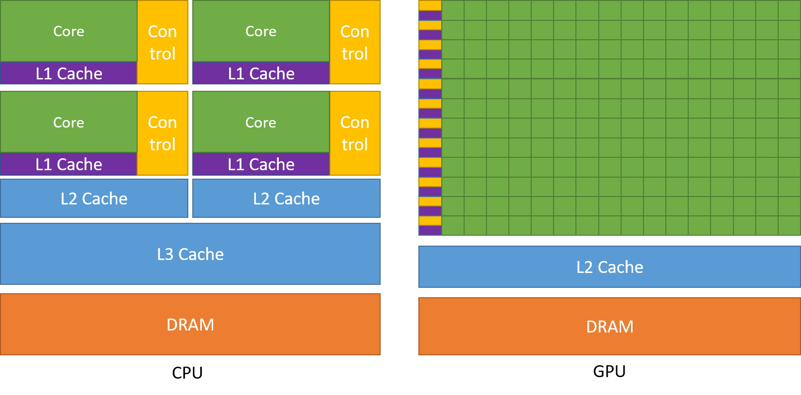

# 1.1. Introducción

## 1.1.1. La Unidad de Procesamiento Gráfico (GPU)

La Unidad de Procesamiento Gráfico (GPU), originalmente concebida como un procesador especializado para gráficos 3D, comenzó como hardware de funciones fijas para acelerar operaciones paralelas en tiempo real en el renderizado 3D. A lo largo de sucesivas generaciones, las GPUs se volvieron más programables. Para 2003, algunas etapas del pipeline gráfico se volvieron completamente programables, ejecutando código personalizado en paralelo para cada componente de una escena 3D o una imagen.

En 2006, NVIDIA introdujo la _Compute Unified Device Architecture_ (CUDA) para permitir que cualquier carga de trabajo computacional utilizara la capacidad de rendimiento de las GPUs de forma independiente de las APIs gráficas.

Desde entonces, CUDA y la computación en GPU se han utilizado para acelerar cargas de trabajo computacionales de prácticamente cualquier tipo, desde simulaciones científicas como la dinámica de fluidos o el transporte de energía hasta aplicaciones comerciales como bases de datos y análisis. Además, la capacidad y la programabilidad de las GPUs han sido fundamentales para el avance de nuevos algoritmos y tecnologías, que van desde la clasificación de imágenes hasta la inteligencia artificial generativa, como la difusión o los modelos de lenguaje grandes.

## 1.1.2. Los Beneficios de Utilizar GPUs

Una GPU proporciona un mayor rendimiento de instrucciones y ancho de banda de memoria que una CPU dentro de un rango de precio y consumo de energía similares. Muchas aplicaciones aprovechan estas capacidades para ejecutarse significativamente más rápido en la GPU que en la CPU (ver [Aplicaciones con GPU](https://www.nvidia.com/en-us/accelerated-applications/)). Otros dispositivos de computación, como las FPGAs, también son muy eficientes energéticamente, pero ofrecen mucha menos flexibilidad de programación que las GPUs.

Las GPUs y las CPUs están diseñadas con diferentes objetivos en mente. Mientras que una CPU está diseñada para sobresalir en la ejecución de una secuencia serial de operaciones (llamada "thread") lo más rápido posible, y puede ejecutar decenas de estos "threads" en paralelo, una GPU está diseñada para sobresalir en la ejecución de miles de "threads" en paralelo, sacrificando un menor rendimiento de un solo "thread" para lograr un rendimiento total mucho mayor.

Las GPUs están especializadas en cálculos altamente paralelos y destinan más transistores a unidades de procesamiento de datos, mientras que las CPUs destinan más transistores al almacenamiento de caché y al control de flujo. [Figura 1](#f001) muestra una distribución de ejemplo de los recursos del chip para una CPU en comparación con una GPU.

> 
> 
> _Figura 1._ La GPU Destina Más Transistores al Procesamiento de Datos

## 1.1.3. Empezar Rápidamente

Existen muchas formas de aprovechar el poder de cómputo proporcionado por las GPUs. Esta guía cubre la programación para la plataforma GPU CUDA utilizando lenguajes de alto nivel como C++. Sin embargo, hay muchas formas de utilizar GPUs en aplicaciones que no requieren escribir código GPU directamente.

Una creciente colección de algoritmos y rutinas de diversos dominios está disponible a través de bibliotecas especializadas. Cuando una biblioteca ya ha sido implementada, especialmente aquellas proporcionadas por NVIDIA, utilizarla suele ser más productiva y eficiente que reimplementar algoritmos desde cero. Bibliotecas como cuBLAS, cuFFT, cuDNN y CUTLASS son solo algunos ejemplos de bibliotecas que ayudan a los desarrolladores a evitar la reimplementación de algoritmos bien establecidos. Estas bibliotecas tienen el beneficio adicional de estar optimizadas para cada arquitectura de GPU, proporcionando una combinación ideal de productividad, rendimiento y portabilidad.

También existen frameworks, particularmente aquellos utilizados para la inteligencia artificial, que proporcionan bloques de construcción acelerados por GPU. Muchos de estos frameworks logran su aceleración aprovechando las bibliotecas aceleradas por GPU mencionadas anteriormente.

Además, los lenguajes de dominio específicos (DSL) como Warp de NVIDIA o Triton de OpenAI se compilan para ejecutarse directamente en la plataforma CUDA. Esto proporciona un método de programación de GPUs aún más de alto nivel que los lenguajes de alto nivel cubiertos en esta guía.

El [NVIDIA Accelerated Computing Hub](https://github.com/NVIDIA/accelerated-computing-hub) contiene recursos, ejemplos y tutoriales para aprender la computación con GPU y CUDA.
