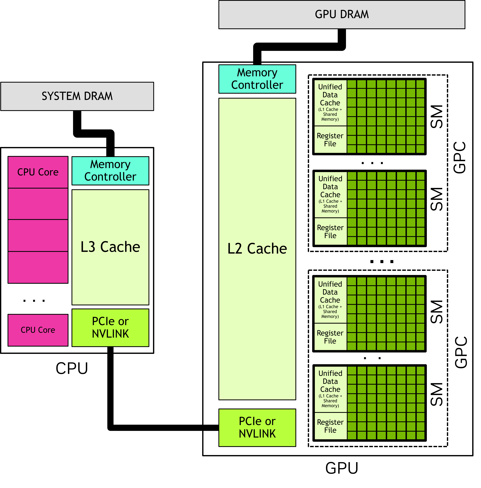
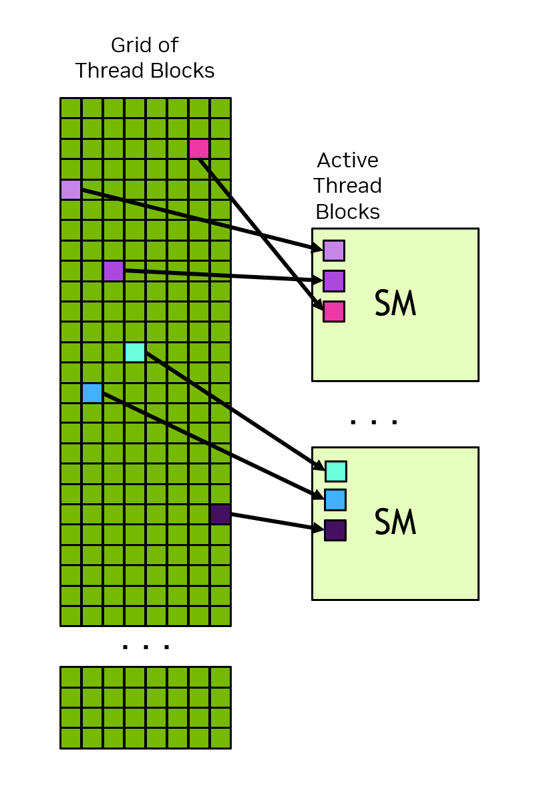
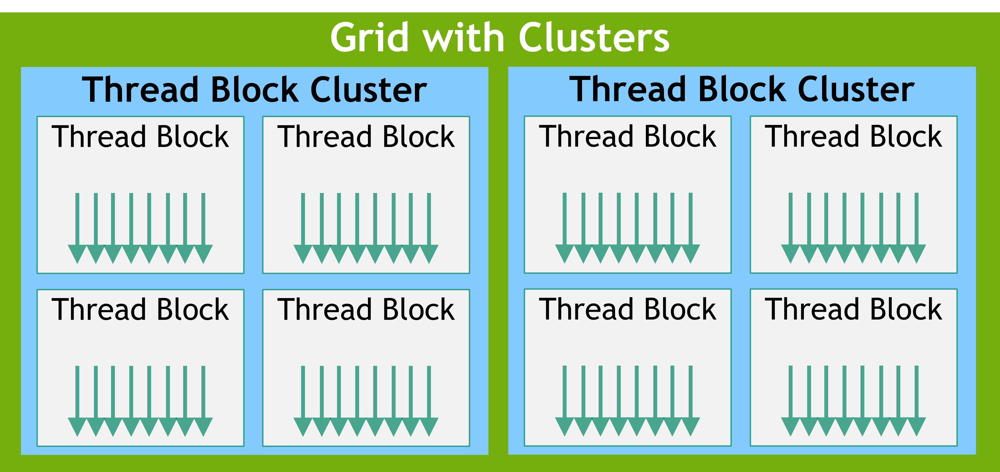
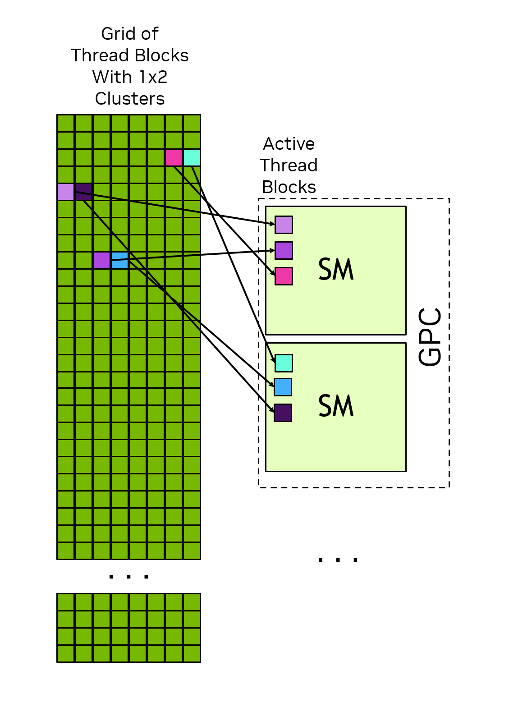
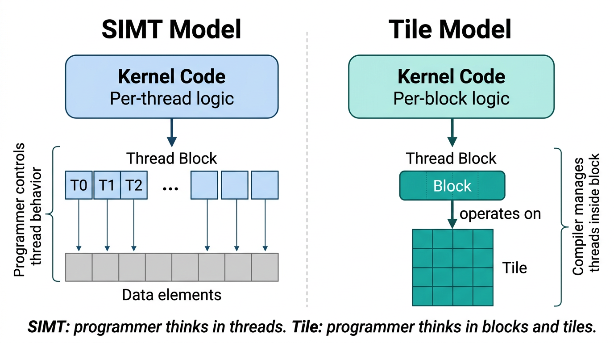
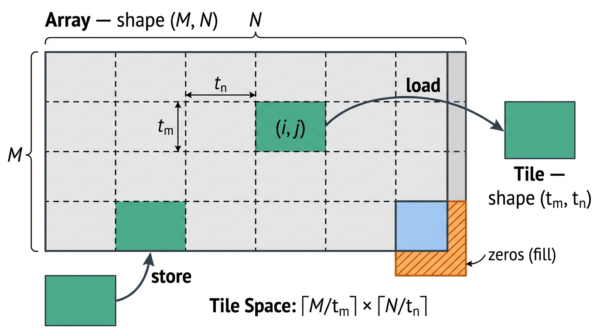

# 1.2. Modelo de programación

Este capítulo introduce el modelo de programación de CUDA a un nivel general y sin depender de ningún lenguaje específico. La terminología y los conceptos presentados aquí son aplicables a CUDA en cualquier lenguaje de programación compatible. Los capítulos posteriores ilustrarán estos conceptos en C++.

## 1.2.1. Sistemas heterogéneos

El modelo de programación CUDA asume un sistema de computación heterogéneo, lo que significa un sistema que incluye tanto GPUs como CPUs. La CPU y la memoria directamente conectada a ella se denominan, respectivamente, *host* y *memoria del host*. Una GPU y la memoria directamente conectada a ella se denominan, respectivamente, *dispositivo* y *memoria del dispositivo*. En algunos sistemas "chip on a chip" (SoC), estos pueden formar parte de un solo paquete. En sistemas más grandes, puede haber múltiples CPUs o GPUs.

Las aplicaciones de CUDA ejecutan parte de su código en la GPU, pero las aplicaciones siempre inician la ejecución en la CPU. El código del host, que es el código que se ejecuta en la CPU, puede utilizar las APIs de CUDA para copiar datos entre la memoria del host y la memoria del dispositivo, iniciar la ejecución del código en la GPU y esperar a que se completen las copias de datos o el código de la GPU. Tanto la CPU como la GPU pueden estar ejecutando código simultáneamente, y el mejor rendimiento generalmente se obtiene maximizando el uso tanto de las CPUs como de las GPUs.

El código que una aplicación ejecuta en la GPU se denomina *código del dispositivo*, y una función que se invoca para la ejecución en la GPU se denomina, por razones históricas, un *kernel*. El acto de iniciar un kernel en ejecución se denomina *lanzar* el kernel. Un lanzamiento de kernel puede considerarse como iniciar múltiples hilos que ejecutan el código del kernel en paralelo en la GPU. Los hilos de la GPU funcionan de manera similar a los hilos en las CPUs, aunque existen algunas diferencias importantes tanto para la corrección como para el rendimiento, que se cubrirán en secciones posteriores (ver [Sección 3.2.2.1.1](../03-advanced/advanced-kernel-programming.md#advanced-kernels-independent-thread-scheduling)).

## 1.2.2. Modelo de hardware de la GPU

Al igual que cualquier modelo de programación, CUDA se basa en un modelo conceptual del hardware subyacente. Para los fines de la programación con CUDA, la GPU puede considerarse como una colección de *Procesadores Multiproceso de Flujo* (SM), que están organizados en grupos llamados *Clusters de Procesamiento Gráfico* (GPC). Cada SM contiene un archivo de registros local, una caché de datos unificada y un número de unidades funcionales que realizan cálculos. La caché de datos unificada proporciona los recursos físicos para la *memoria compartida* y la caché L1. La asignación de la caché de datos unificada a la memoria L1 y compartida puede configurarse en tiempo de ejecución. Los tamaños de los diferentes tipos de memoria y el número de unidades funcionales dentro de un SM pueden variar según las arquitecturas de la GPU.

> [!NOTE]
>
> La disposición real del hardware de una GPU o la forma en que se ejecuta físicamente el modelo de programación puede variar. Estas diferencias no afectan la corrección del software escrito utilizando el modelo de programación CUDA.

**Figura 2.** *Una GPU tiene muchos procesadores multiproceso de flujo (SM), cada uno de los cuales contiene muchas unidades funcionales. Los clusters de procesamiento gráfico (GPC) son colecciones de SM. Una GPU es un conjunto de GPC conectados a la memoria de la GPU. Una CPU normalmente tiene varios núcleos y un controlador de memoria que se conecta a la memoria del sistema. Una CPU y una GPU están conectadas mediante una interconexión como PCIe o NVLINK.*

### 1.2.2.1. Bloques de hilos y rejillas

Cuando una aplicación lanza un kernel, lo hace con muchos hilos, a menudo millones de hilos. Estos hilos están organizados en bloques. Un bloque de hilos se denomina, quizás no de forma sorprendente, un *bloque de hilos*. Los bloques de hilos están organizados en una *rejilla*. Todos los bloques de hilos en una rejilla tienen el mismo tamaño y dimensiones. La figura 3 ([programming-model.md#thread-hierarchy-grid-of-thread-blocks]) muestra una ilustración de una rejilla de bloques de hilos.

**Figura 3.** *Rejilla de bloques de hilos. Cada flecha representa un hilo (el número de flechas no representa el número real de hilos).*

Los bloques de hilos y las rejillas pueden ser de 1, 2 o 3 dimensiones. Estas dimensiones pueden simplificar la asignación de hilos individuales a unidades de trabajo o elementos de datos.

Cuando se lanza un kernel, se lanza utilizando una configuración de *ejecución* específica, que especifica las dimensiones de la rejilla y del bloque de hilos. La configuración de ejecución también puede incluir parámetros opcionales, como el tamaño del clúster, la configuración del flujo y de la SM, que se introducirán en secciones posteriores.

Utilizando variables incorporadas, cada hilo que ejecuta el kernel puede determinar su ubicación dentro de su bloque contenedor y la ubicación del bloque dentro de la rejilla contenedora. Un hilo también puede utilizar estas variables incorporadas para determinar las dimensiones de los bloques de hilos y la rejilla en la que se lanzó el kernel. Esto proporciona a cada hilo una identidad única entre todos los hilos que ejecutan el kernel. Esta identidad se utiliza con frecuencia para determinar qué datos o operaciones es responsable un hilo.

Todos los hilos de un bloque de hilos se ejecutan en una única SM. Esto permite que los hilos dentro de un bloque de hilos se comuniquen y se sincronicen de forma eficiente. Todos los hilos dentro de un bloque de hilos tienen acceso a la memoria compartida integrada, que se puede utilizar para intercambiar información entre los hilos de un bloque de hilos.

Una rejilla puede consistir en millones de bloques de hilos, mientras que la GPU que ejecuta la rejilla puede tener solo decenas o cientos de SM. Todos los hilos de un bloque de hilos se ejecutan en una única SM y, en la mayoría de los casos, se completan en esa SM. No hay garantía de programación entre bloques de hilos, por lo que un bloque de hilos no puede depender de los resultados de otros bloques de hilos, ya que es posible que no puedan programarse hasta que se haya completado ese bloque de hilos. La figura 4 ([programming-model.md#thread-block-scheduling]) muestra un ejemplo de cómo se asignan los bloques de hilos de una rejilla a una SM.

**Figura 4.** *Cada SM tiene uno o más bloques de hilos activos. En este ejemplo, cada SM tiene tres bloques de hilos programados simultáneamente. No hay garantías sobre el orden en que se asignan los bloques de hilos de una rejilla a las SMs.*

El modelo de programación CUDA permite que se ejecuten rejillas de tamaño arbitrario en GPUs de cualquier tamaño, ya sea que tengan una única SM o miles de SM. Para lograr esto, el modelo de programación CUDA, con algunas excepciones, requiere que no haya dependencias de datos entre los hilos en diferentes bloques de hilos. Es decir, un hilo no debe depender de los resultados de o sincronizarse con un hilo en un bloque de hilos diferente de la misma rejilla. Todos los hilos dentro de un bloque de hilos se ejecutan en la misma SM al mismo tiempo. Los diferentes bloques de hilos dentro de la rejilla se programan entre las SM disponibles y pueden ejecutarse en cualquier orden. En resumen, el modelo de programación CUDA requiere que sea posible ejecutar los bloques de hilos en cualquier orden, en paralelo o en serie.

#### 1.2.2.1.1. Agrupaciones de bloques de hilos

Además de los bloques de hilos, las GPUs con capacidad de cálculo 9.0 o superior tienen un nivel opcional de agrupación llamado *agrupaciones*. Las agrupaciones son un grupo de bloques de hilos que, al igual que los bloques de hilos y las rejillas, pueden organizarse en 1, 2 o 3 dimensiones. [Figura 5](programming-model.md#figure-thread-block-clusters) ilustra una rejilla de bloques de hilos que también está organizada en agrupaciones. Especificar agrupaciones no cambia las dimensiones de la rejilla ni los índices de un bloque de hilos dentro de una rejilla.

**Figura 5.** *Cuando se especifican agrupaciones, los bloques de hilos están en la misma ubicación en la rejilla, pero también tienen una posición dentro de la agrupación contenedora.*

Especificar agrupaciones agrupa bloques de hilos adyacentes en agrupaciones y proporciona algunas oportunidades adicionales para la sincronización y la comunicación a nivel de agrupación. Específicamente, todos los bloques de hilos dentro de una agrupación se ejecutan en un único GPC. [Figura 6](programming-model.md#thread-block-scheduling-with-clusters) muestra cómo se programan los bloques de hilos a los SMs en un GPC cuando se especifican las agrupaciones. Dado que los bloques de hilos se programan simultáneamente y dentro de un único GPC, los hilos en diferentes bloques, pero dentro de la misma agrupación, pueden comunicarse y sincronizarse entre sí utilizando las interfaces de software proporcionadas por [Grupos Cooperativos](../02-basics/writing-cuda-kernels.md#writing-cuda-kernels-cooperative-groups). Los hilos en agrupaciones pueden acceder a la memoria compartida de todos los bloques dentro de la agrupación, que se denomina [memoria compartida distribuida](../02-basics/writing-cuda-kernels.md#writing-cuda-kernels-distributed-shared-memory). El tamaño máximo de una agrupación depende del hardware y varía entre los dispositivos.

[Figura 6](programming-model.md#thread-block-scheduling-with-clusters) ilustra cómo se programan simultáneamente los bloques de hilos dentro de una agrupación en los SMs dentro de un GPC. Los bloques de hilos dentro de una agrupación siempre están adyacentes entre sí dentro de la rejilla.

**Figura 6.** *Cuando se especifican agrupaciones, los bloques de hilos dentro de una agrupación se organizan en su forma dentro de la rejilla. Los bloques de hilos de una agrupación se programan simultáneamente en los SMs de un único GPC.*

### 1.2.2.2. Hilos y SIMT

Dentro de un bloque de hilos, los hilos se organizan en grupos de 32 hilos llamados *hilos*. Un hilo ejecuta el código del kernel en un paradigma de *Single-Instruction Multiple-Threads* (SIMT). En SIMT, todos los hilos dentro del hilo ejecutan el mismo código del kernel, pero cada hilo puede seguir diferentes ramas dentro del código. Es decir, aunque todos los hilos del programa ejecutan el mismo código, los hilos no necesitan seguir la misma secuencia de ejecución.

Cuando los hilos se ejecutan dentro de un hilo, se les asigna una "carretera" del hilo. Las "carreteras" del hilo están numeradas de 0 a 31, y los hilos de un bloque de hilos se asignan a hilos dentro de un hilo de manera predecible, como se detalla en [Multithreading de hardware](../03-avanzado/programación-del-kernel-avanzado.md#kernels-avanzados-implementación-de-hardware-multithreading).

Todos los hilos dentro del hilo ejecutan la misma instrucción simultáneamente. Si algunos hilos dentro de un hilo siguen una rama de control durante la ejecución, mientras que otros no, los hilos que no siguen la rama se "mascaran" mientras que los hilos que sí la siguen se ejecutan. Por ejemplo, si una condición solo es verdadera para la mitad de los hilos en un hilo, la otra mitad del hilo se "mascararía" mientras que los hilos activos ejecutarían esas instrucciones. Esta situación se ilustra en [Figura 7](modelo-de-programación.md#hilos-activos). Cuando diferentes hilos en un hilo siguen diferentes caminos de código, esto a veces se denomina divergencia del hilo. Por lo tanto, la utilización de la GPU se maximiza cuando los hilos dentro de un hilo siguen el mismo camino de control.

**Figura 7.** *En este ejemplo, solo los hilos con un índice de hilo par ejecutan el cuerpo de la instrucción "if", mientras que los demás se "mascaran" mientras se ejecuta el cuerpo.*

En el modelo SIMT, todos los hilos en un hilo avanzan a través del kernel de forma sincronizada. La ejecución en hardware puede diferir. Consulte las secciones sobre [Ejecución independiente de hilos](../03-avanzado/programación-del-kernel-avanzado.md#kernels-avanzados-programación-independiente-de-hilos) para obtener más información sobre dónde es importante esta distinción. Se desaconseja explotar el conocimiento de cómo se mapea realmente la ejecución del hilo al hardware. El modelo de programación de CUDA y SIMT indican que todos los hilos en un hilo avanzan a través del código juntos. El hardware puede optimizar las "carreteras" "mascaradas" de maneras que son transparentes para el programa, siempre y cuando se siga el modelo de programación. Si el programa viola este modelo, esto puede resultar en un comportamiento indefinido que puede ser diferente en diferentes hardware de GPU.

Aunque no es necesario considerar los hilos al escribir código de CUDA, comprender el modelo de ejecución del hilo es útil para comprender conceptos como [acceso coherente a la memoria global](../02-básico/escribir-kernels-cuda.md#escribir-kernels-cuda-acceso-coherente-a-la-memoria-global) y [patrones de acceso a la memoria compartida](../02-básico/escribir-kernels-cuda.md#escribir-kernels-cuda-acceso-a-la-memoria-compartida). Algunas técnicas de programación avanzadas utilizan la especialización de hilos dentro de un bloque de hilos para limitar la divergencia del hilo y maximizar la utilización. Esto y otras optimizaciones aprovechan el conocimiento de que los hilos se agrupan en hilos cuando se ejecutan.

Una implicación de la ejecución del hilo es que los bloques de hilos deben especificarse para tener un número total de hilos que sea un múltiplo de 32. Es legal utilizar cualquier número de hilos, pero cuando el total no es un múltiplo de 32, la última "carretera" del bloque de hilos tendrá algunas "carreteras" que no se utilizarán durante la ejecución. Esto probablemente conducirá a una utilización subóptima de las unidades funcionales y el acceso a la memoria para esa "carretera".

> SIMT se compara a menudo con el paralelismo de *Single Instruction Multiple Data* (SIMD), pero existen algunas diferencias importantes. En SIMD, la ejecución sigue una única trayectoria de control, mientras que en SIMT, cada hilo puede seguir su propia trayectoria de control. Debido a esto, SIMT no tiene un ancho de datos fijo como SIMD. Una discusión más detallada sobre SIMT se puede encontrar en [Modelo de ejecución SIMT](../03-avanzado/programación-del-kernel-avanzado.md#kernels-avanzados-implementación-de-hardware-simt-arquitectura).

### 1.2.2.3. Programación de "tiles" en CUDA

Además del modelo SIMT descrito en las secciones anteriores, CUDA también soporta un modelo de programación basado en "tiles". En la programación basada en "tiles", el programador escribe código a nivel de un bloque de hilos completo, describiendo operaciones en colecciones multidimensionales de datos llamadas **tiles**. El compilador asigna estas operaciones a los hilos individuales del bloque.

Los "kernels" de "tiles" se ejecutan en una cuadrícula de bloques, como se describe en la sección [Bloques de hilos y cuadrículas](programming-model.md#programming-model-threads-grids). Cada bloque ejecuta el "kernel" de "tiles" y puede consultar su posición dentro de la cuadrícula para determinar qué parte de los datos es responsable. El programador especifica únicamente las dimensiones de la cuadrícula; el número de hilos por bloque se determina por el compilador en función de las operaciones en el "kernel" ([Figura 8](programming-model.md#figure-tile-programming-abstraction)).

**Figura 8.** *Vista del programador en los modelos SIMT y de programación de "tiles". En el modelo SIMT, el programador escribe código para cada hilo y controla cómo cada hilo accede a los datos. En la programación basada en "tiles", el programador escribe código para cada bloque que opera en "tiles"; el compilador asigna las operaciones a los hilos del bloque.*

Dentro de un "kernel" de "tiles", un bloque ejecuta un único flujo de control. El programador especifica operaciones en "tiles", y el compilador distribuye el trabajo entre los hilos del bloque. Se admiten estructuras de control estándar como las condiciones y los bucles, pero dado que el bloque sigue un único flujo de control, no existe el concepto de divergencia de "warp". Las operaciones escalares, como calcular un índice o el límite de un bucle, se ejecutan en un solo hilo del bloque. Las operaciones de "tiles", como sumar dos "tiles" elemento por elemento, se ejecutan en paralelo por todos los hilos del bloque.

Es importante no confundir los bloques (unidades de ejecución) con los "tiles" (unidades de datos). Un solo bloque puede crear y operar con muchos "tiles" de diferentes formas y tipos de datos.

#### 1.2.2.3.1. Arrays y bloques de datos

Los kernels de bloques de datos trabajan con dos tipos de datos: **arrays** y **bloques de datos**. Un array (o array global) es un contenedor multidimensional de elementos almacenados en la memoria del dispositivo. Los arrays son modificables: su contenido puede ser modificado mediante operaciones de almacenamiento dentro de un kernel. Un array tiene una forma y un tipo de datos.

Un bloque de datos es una colección multidimensional de valores que existe únicamente dentro del código del bloque y es local a un solo bloque. Los bloques de datos son inmutables: cada operación en un bloque de datos produce un nuevo bloque de datos en lugar de modificar uno existente. A diferencia de un array, un bloque de datos no necesariamente tiene una representación en la memoria: el compilador decide cómo se almacenan los datos del bloque, y puede utilizar registros, memoria compartida u otros recursos del SM. Cada dimensión de un bloque de datos debe ser una potencia de dos y debe ser conocida en tiempo de compilación (es decir, su valor debe ser determinable antes de que se ejecute el kernel, en lugar de calcularse durante la ejecución). Los bloques de datos no pueden pasarse como parámetros de un kernel; se crean y se consumen por completo dentro del código del bloque.

#### 1.2.2.3.2. Espacio de los bloques y movimiento de datos

Los datos se mueven entre los arreglos y los bloques a través de operaciones de carga y almacenamiento. Estas operaciones utilizan un concepto llamado **espacio de bloques**, que es el resultado de dividir conceptualmente un arreglo en bloques de tamaño igual y no superpuestos. Por ejemplo, considere un arreglo bidimensional de dimensiones (M, N). Si una operación de carga especifica una forma de bloque de (tm, tn), el arreglo se divide conceptualmente en $\lceil M/t_m \rceil$ filas y $\lceil N/t_n \rceil$ columnas de bloques. Un índice en este espacio de bloques, como (i, j), identifica qué bloque se debe cargar. La carga devuelve un bloque de dimensiones (tm, tn) que contiene los elementos correspondientes del arreglo. Cuando un bloque se extiende más allá de los límites del arreglo, por ejemplo, en los bordes cuando las dimensiones del arreglo no son múltiplos exactos de las dimensiones del bloque, la carga especifica cómo se manejan los elementos fuera de los límites, como rellenándolos con ceros ([Figura 9](programming-model.md#figure-tile-space-data-movement)).

**Figura 9.** *Espacio de bloques y movimiento de datos. Un arreglo bidimensional de dimensiones (M, N) se divide conceptualmente en una cuadrícula de bloques con dimensiones (tm, tn). Una carga en el índice del espacio de bloques (i, j) devuelve el bloque correspondiente. En el límite del arreglo, los elementos que caen fuera del arreglo pueden rellenarse con ceros. Una operación de almacenamiento escribe un bloque de nuevo en el arreglo en un índice específico del espacio de bloques.*

Una operación de almacenamiento realiza la operación inversa: dado un bloque y un índice en el espacio de bloques, escribe los elementos del bloque en la región correspondiente del arreglo. Cualquier escritura que caiga fuera de los límites del arreglo se descarta silenciosamente. Los programas de bloques también admiten operaciones de recopilación y dispersión, que cargan o almacenan en posiciones arbitrarias en un arreglo.

#### 1.2.2.3.3. Operaciones con elementos

Los programas para trabajar con elementos proporcionan un conjunto de operaciones incorporadas que actúan sobre los elementos, incluyendo operaciones aritméticas elemento por elemento, multiplicación de matrices, reducciones (como suma y máximo) a lo largo de uno o más ejes, manipulación de la forma (como remodelar y transponer), y conversión de tipos. Cuando dos elementos de diferentes formas se combinan en una operación, el elemento más pequeño se expande automáticamente para que coincida con el elemento más grande antes de que se aplique la operación.

#### 1.2.2.3.4. Relación con la programación SIMT

La programación basada en "tiles" y la programación SIMT coexisten dentro de CUDA. Una aplicación puede contener tanto "kernels" SIMT como "kernels" basados en "tiles", y ambos tipos de "kernels" pueden operar en la misma memoria del dispositivo. La elección del modelo de programación es una decisión específica para cada "kernel". La programación basada en "tiles" no reemplaza la programación SIMT. SIMT proporciona un control más detallado sobre los hilos individuales, lo cual sigue siendo necesario para algunos algoritmos y técnicas de optimización. La programación basada en "tiles" proporciona una abstracción de nivel superior que puede simplificar el desarrollo de "kernels". Debido a que las decisiones a nivel de hilo son dejadas al compilador, el mismo "kernel" basado en "tiles" puede ejecutarse en diferentes arquitecturas de GPU sin necesidad de modificar el código fuente. Ambos modelos se basan en el mismo hardware subyacente: SMs, bloques de hilos y "grids", que se describen en las secciones anteriores. Ambos modelos también utilizan los mismos espacios de memoria del dispositivo, que se introducen en la siguiente sección.

## 1.2.3. Memoria de la GPU

En los sistemas de computación modernos, utilizar la memoria de manera eficiente es tan importante como maximizar el uso de las unidades funcionales que realizan cálculos. Los sistemas heterogéneos tienen múltiples espacios de memoria, y las GPUs contienen varios tipos de memoria programable integrada, además de las memorias caché. Las siguientes secciones presentan estos espacios de memoria con más detalle.

### 1.2.3.1. Memoria DRAM en sistemas heterogéneos

Las GPUs y las CPUs tienen chips de DRAM con conexión directa. En sistemas con más de una GPU, cada GPU tiene su propia memoria. Desde la perspectiva del código del dispositivo, el DRAM conectado a la GPU se denomina *memoria global*, ya que es accesible para todos los SM (Unidades de procesamiento) en la GPU. Este término no significa necesariamente que sea accesible en todas partes dentro del sistema. El DRAM conectado a la CPU(s) se denomina *memoria del sistema* o *memoria del host*.

Al igual que las CPUs, las GPUs utilizan la direccionamiento de memoria virtual. En todos los sistemas actualmente soportados, la CPU y la GPU utilizan un único espacio de memoria virtual unificado. Esto significa que el rango de direcciones de memoria virtual para cada GPU en el sistema es único y distinto tanto de la CPU como de todas las demás GPUs en el sistema. Para una dirección de memoria virtual dada, es posible determinar si esa dirección está en la memoria de la GPU o en la memoria del sistema, y, en sistemas con múltiples GPUs, qué memoria de la GPU contiene esa dirección.

Existen APIs de CUDA para asignar memoria de GPU, memoria de CPU, y para copiar entre asignaciones en la CPU y la GPU, dentro de la GPU, o entre GPUs en sistemas con múltiples GPUs. La localidad de los datos puede controlarse explícitamente cuando sea necesario. [Memoria unificada](programming-model.md#programming-model-unified-memory), que se discute a continuación, permite que la ubicación de la memoria sea gestionada automáticamente por el entorno de ejecución de CUDA o el hardware del sistema.

### 1.2.3.2. Dominios de localidad:

Un *dominio de localidad* es un subconjunto de la memoria y los multiprocesadores de streaming (SM) de una GPU. Todas las GPUs tienen al menos un dominio de localidad. Las GPUs más grandes pueden tener más de un dominio de localidad. En las GPUs con más de un dominio de localidad, el rendimiento de algunos kernels puede mejorarse utilizando memoria y computación *localizadas*. La *memoria localizada* es una asignación de memoria que se encuentra completamente dentro de un único dominio de localidad. Los kernels que utilizan esta memoria pueden programarse en los SM dentro del mismo dominio de localidad. Las aplicaciones se benefician de la localización cuando la memoria y la computación se dividen entre los dominios de localidad y se pueden enviar tareas a cada dominio de localidad en paralelo.

La memoria de la GPU que se asigna sin especificar un dominio de localidad se considera *no localizada*. Las asignaciones de memoria no localizada abarcan varios dominios de localidad, excepto en el caso de asignaciones muy pequeñas.

En las GPUs con un único dominio de localidad, todos los SM y la memoria de la GPU forman parte de ese único dominio de localidad.

La sección 4.7 [Section 4.7](../04-special-topics/locality-domains.md#locality-domains) muestra los mecanismos para localizar la memoria y la computación de la GPU dentro de un dominio de localidad específico. Los dominios de localidad son una característica de rendimiento: el código CUDA que no localiza la memoria o la computación seguirá ejecutándose correctamente.

### 1.2.3.3. Memoria integrada en las GPU

Además de la memoria global, cada GPU tiene cierta memoria integrada. Cada SM (unidad de ejecución) tiene su propio archivo de registros y memoria compartida. Estas memorias forman parte del SM y pueden ser accedidas extremadamente rápido por los hilos que se ejecutan dentro del SM.

El archivo de registros almacena variables locales del hilo, que normalmente son asignadas por el compilador. La memoria compartida es accesible para todos los hilos dentro de un bloque o grupo de hilos. La memoria compartida se puede utilizar para intercambiar datos entre hilos de un bloque o grupo de hilos.

El archivo de registros y la caché de datos unificada en un SM tienen tamaños finitos. El tamaño del archivo de registros, la caché de datos unificada, y la forma en que se puede configurar la caché de datos unificada para L1 y la memoria compartida se pueden encontrar en [Información sobre la memoria según la capacidad de cómputo](../05-appendices/compute-capabilities.md#compute-capabilities-table-memory-information-per-compute-capability). El archivo de registros, el espacio de memoria compartida y la caché L1 se comparten entre todos los hilos de un bloque de hilos.

Para programar un bloque de hilos en un SM, el número total de registros necesarios para cada hilo multiplicado por el número de hilos en el bloque de hilos debe ser menor o igual que el número de registros disponibles en el SM. Si el número de registros necesarios para un bloque de hilos excede el tamaño del archivo de registros, el kernel no se puede lanzar y el número de hilos en el bloque de hilos debe reducirse para que el bloque de hilos se pueda lanzar.

Las asignaciones de memoria compartida se realizan a nivel de bloque de hilos. Es decir, a diferencia de las asignaciones de registros, que son por hilo, las asignaciones de memoria compartida son comunes para todo el bloque de hilos.

#### 1.2.3.3.1. Cachés

Además de la memoria programable, las GPUs tienen cachés L1 y L2. Cada SM (Unidad de Ejecución) tiene una caché L1, que forma parte de la caché de datos unificada. Una caché L2 más grande se comparte entre todos los SMs dentro de una GPU. Esto se puede ver en el diagrama de bloques de la GPU en [Figura 2](programming-model.md#gpu-cpu-system-diagram). Cada SM también tiene una caché de [constantes] separada (en ../02-basics/writing-cuda-kernels.md#writing-cuda-kernels-constant-memory), que se utiliza para almacenar valores en la memoria global que se han declarado como constantes durante la vida de un kernel. El compilador también puede colocar parámetros del kernel en la memoria de constantes. Esto puede mejorar el rendimiento del kernel al permitir que los parámetros del kernel se almacenen en el SM de forma independiente de la caché de datos L1.

### 1.2.3.4. Memoria unificada

Cuando una aplicación asigna memoria de forma explícita en la GPU o en la CPU, esa memoria solo es accesible para el código que se ejecuta en ese dispositivo. Es decir, la memoria de la CPU solo puede ser accedida desde el código de la CPU, y la memoria de la GPU solo puede ser accedida desde los kernels que se ejecutan en la GPU[^2]. Las APIs de CUDA para copiar memoria entre la CPU y la GPU se utilizan para copiar explícitamente los datos a la memoria correcta en el momento adecuado.

Una característica de CUDA llamada "memoria unificada" permite que las aplicaciones realicen asignaciones de memoria que pueden ser accedidas desde la CPU o la GPU. El entorno de ejecución de CUDA o el hardware subyacente permiten acceder o trasladar los datos al lugar correcto cuando sea necesario. Incluso con memoria unificada, el rendimiento óptimo se logra manteniendo la migración de la memoria al mínimo y accediendo a los datos directamente desde el procesador que está conectado a la memoria donde se encuentran, en la medida de lo posible.

Las características de hardware del sistema determinan cómo se logra el acceso y el intercambio de datos entre los espacios de memoria. La sección "[Memoria unificada](../02-basics/understanding-memory.md#memory-unified-memory)" introduce las diferentes categorías de sistemas de memoria unificada. La sección "[Memoria unificada](../04-special-topics/unified-memory.md#um-details-intro)" contiene muchos más detalles sobre el uso y el comportamiento de la memoria unificada en todas las situaciones.

[^1]: En ciertas situaciones, al utilizar características como [Paralelismo dinámico de CUDA](../04-special-topics/dynamic-parallelism.md#cuda-dynamic-parallelism), un bloque de hilos puede ser suspendido en la memoria. Esto significa que el estado del SM (unidad de ejecución) se almacena en un área de memoria de la GPU gestionada por el sistema, y el SM se libera para ejecutar otros bloques de hilos. Esto es similar al cambio de contexto en las CPUs. Esto no es común.

[^2]: Una excepción a esto es [memoria mapeada](../02-basics/understanding-memory.md#memory-mapped-memory), que es memoria de la CPU asignada con propiedades que permiten su acceso directo desde la GPU. Sin embargo, el acceso mapeado se realiza a través de la conexión PCIe o NVLINK. La GPU no puede ocultar la mayor latencia y el menor ancho de banda detrás del paralelismo, por lo que la memoria mapeada no es un reemplazo eficiente para la memoria unificada o para colocar los datos en el espacio de memoria adecuado.
