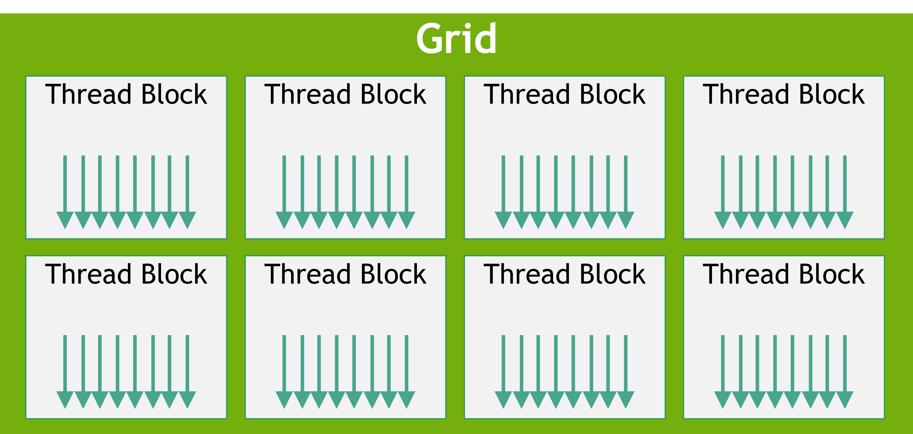
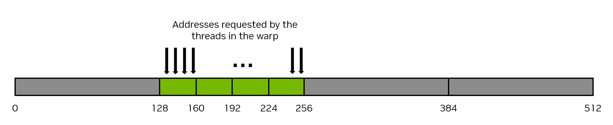
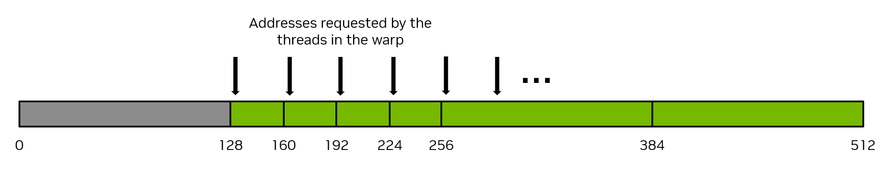
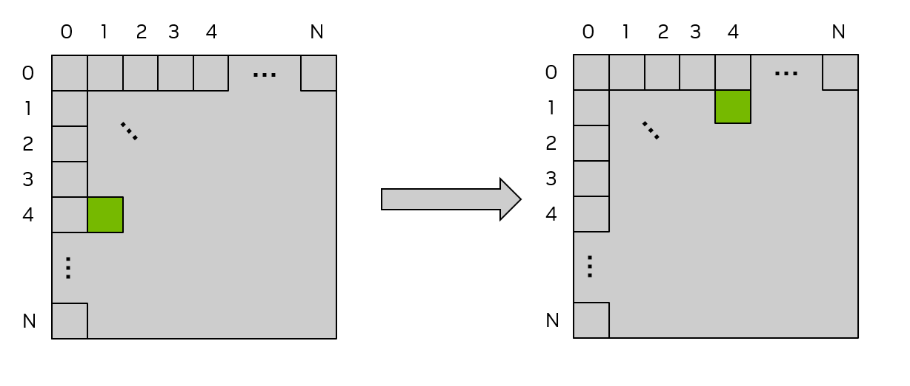
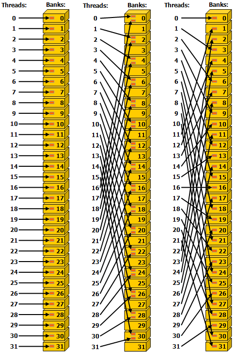
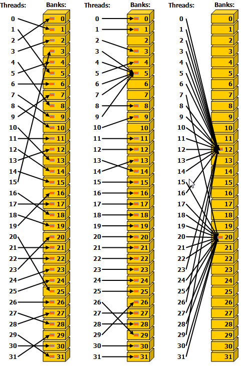
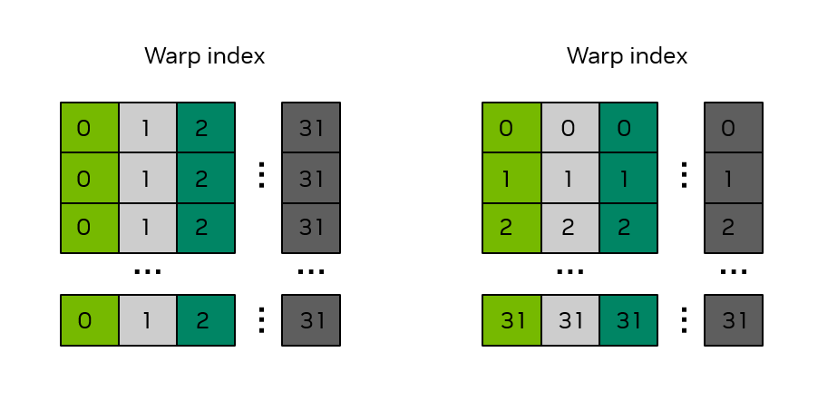
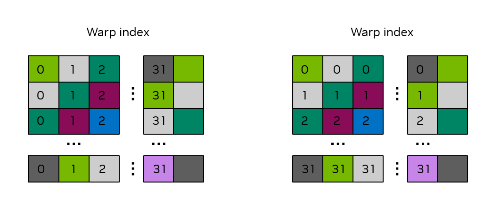

# 2.3. Writing SIMT Kernels

CUDA kernels can largely be written in the same way that traditional CPU code would be written for a given problem. However, there are some unique features of the GPU that can be used to improve performance. Additionally, some understanding of how threads on the GPU are scheduled, how they access memory, and how their execution proceeds can help developers write kernels that maximize utilization of the available computing resources.

This chapter covers some more details of writing kernels using the [SIMT programming model](../01-introduction/programming-model.md#programming-model-warps-simt) in both C++ and Python.

## 2.3.1. Basics of SIMT

From the developer’s perspective, the CUDA thread is the fundamental unit of parallelism. [Section 1.2.2.2](../01-introduction/programming-model.md#programming-model-warps-simt) describes the basic SIMT model of GPU execution and [SIMT Execution Model](../03-advanced/advanced-kernel-programming.md#advanced-kernels-hardware-implementation-simt-architecture) provides additional details of the SIMT model. The SIMT model allows each thread to maintain its own state and control flow. From a functional perspective, each thread can execute a separate code path. However, substantial performance improvements can be realized by taking care that kernel code minimizes the situations where threads in the same warp take divergent code paths.

## 2.3.2. Thread Hierarchy

Threads are organized into thread blocks, which are then organized into a grid. Grids may be 1, 2, or 3 dimensional and the size of the grid can be queried inside a kernel with the `gridDim` built-in variable. Thread blocks may also be 1, 2, or 3 dimensional. The size of the thread block can be queried inside a kernel with the `blockDim` built-in variable. The index of the thread block can be queried with the `blockIdx` built-in variable. Within a thread block, the index of the thread is obtained using the `threadIdx` built-in variable. These built-in variables are used to compute a unique global thread index for each thread, thereby enabling each thread to load/store specific data from global memory and execute a unique code path as needed.

**C++**

- `gridDim.[x|y|z]`: Size of the grid in the `x`, `y` and `z` dimension respectively. These values are the same for all threads and are part of the execution configuration set at kernel launch.
- `blockDim.[x|y|z]`: Size of the block in the `x`, `y` and `z` dimension respectively. These values are the same for all threads and are part of the execution configuration set at kernel launch.
- `blockIdx.[x|y|z]`: Index of the block in the `x`, `y` and `z` dimension respectively. These values will differ among threads, to indicate which thread block is executing.
- `threadIdx.[x|y|z]`: Index of the thread in the `x`, `y` and `z` dimension respectively. These values will differ among threads, to indicate which thread is executing.

**Python**

- `cuda.gridDim.[xyz]`: Size of the grid in the `x`, `y` and `z` dimension respectively. These values are the same for all threads and are part of the execution configuration set at kernel launch.
- `cuda.blockDim.[xyz]`: Size of the block in the `x`, `y` and `z` dimension respectively. These values are the same for all threads and are part of the execution configuration set at kernel launch.
- `cuda.blockIdx.[xyz]`: Index of the block in the `x`, `y` and `z` dimension respectively. These values will differ among threads, to indicate which thread block is executing.
- `cuda.threadIdx.[xyz]`: Index of the thread in the `x`, `y` and `z` dimension respectively. These values will differ among threads, to indicate which thread is executing.

The use of multi-dimensional thread blocks and grids is for convenience only and does not affect performance. The threads of a block are linearized predictably: the first index `x` moves the fastest, followed by `y` and then `z`. This means that in the linearization of a thread indices, consecutive values of `threadIdx.x` indicate consecutive threads, `threadIdx.y` has a stride of `blockDim.x`, and `threadIdx.z` has a stride of `blockDim.x * blockDim.y`. This affects how threads are assigned to warps, as detailed in [Hardware Multithreading](../03-advanced/advanced-kernel-programming.md#advanced-kernels-hardware-implementation-hardware-multithreading).

[Figure 11](writing-cuda-kernels.md#writing-cuda-kernels-thread-hierarchy-review-grid-of-thread-blocks) shows a simple example of a 2D grid, with 1D thread blocks.



**Figure 11.** *Grid of Thread Blocks*

### 2.3.2.1. Thread Block Synchronization

In examples shown previously, there was not a need to synchronize threads within a thread block. When threads within a thread block cooperate or access the same memory addresses, especially in [shared memory](writing-cuda-kernels.md#writing-cuda-kernels-shared-memory), described below, synchronization is necessary to avoid race conditions and memory hazards.

The most basic form of synchronization within a block is called `syncthreads`

## 2.3.3. GPU Device Memory Spaces

CUDA devices have several memory spaces that can be accessed by CUDA threads within kernels. [Table 1](writing-cuda-kernels.md#writing-cuda-kernels-memory-types-scopes-lifetimes) shows a summary of the common memory types, their thread scopes, and their lifetimes. The following sections explain each of these memory types in more detail.

Table 1 Memory Types, Scopes and Lifetimes

| Memory Type | Scope | Lifetime | Location |
| --- | --- | --- | --- |
| Global | Grid | Application | Device |
| Constant | Grid | Application | Device |
| Shared | Block | Kernel | SM |
| Local | Thread | Kernel | Device |
| Register | Thread | Kernel | SM |

### 2.3.3.1. Global Memory

Global memory (also called device memory) is the primary memory space for storing data that is accessible by all threads in a kernel. It is similar to RAM in a CPU system. Kernels running on the GPU have direct access to global memory in the same way code running on the CPU has access to system memory.

Global memory is persistent. That is, an allocation made in global memory and the data stored in it persist until the allocation is freed or until the application is terminated. `cudaDeviceReset` also frees all allocations.

Global memory is allocated with CUDA API calls such as `cudaMalloc` and `cudaMallocManaged`. Data can be copied into global memory from CPU memory using CUDA runtime API calls such as `cudaMemcpy`. Global memory allocations made with CUDA APIs are freed using `cudaFree`.

Prior to a kernel launch, global memory is allocated and initialized by CUDA API calls. During kernel execution, data from global memory can be read by the CUDA threads, and the result from operations carried out by CUDA threads can be written back to global memory. Once a kernel has completed execution, the results it wrote to global memory can be copied back to the host or used by other kernels on the GPU.

Because global memory is accessible by all threads in a grid, care must be taken to avoid data races between threads. Since CUDA kernels launched from the host have the return type `void`, the only way for numerical results computed by a kernel to be returned to the host is by writing those results to global memory.

A simple example illustrating the use of global memory is the kernel shown below, where the three arrays `A`, `B`, and `C` are in global memory and are being accessed by this vector add kernel.

**C++**

```cuda
__global__ void vecAdd(float* A, float* B, float* C, int vectorLength)
{
    int workIndex = threadIdx.x + blockIdx.x*blockDim.x;
    if(workIndex < vectorLength)
    {
        C[workIndex] = A[workIndex] + B[workIndex];
    }
}
```

**Python**

```python
@cuda.jit
def vecadd(A, B, C):
    work_index = cuda.grid(1)
    C[work_index] = A[work_index] + B[work_index]
```

### 2.3.3.2. Shared Memory

Shared memory is a memory space that is accessible by all threads in a thread block. It is physically located on each SM and uses the same physical resource as the L1 cache, the unified data cache. The data in shared memory persists throughout the kernel execution. Shared memory can be considered a user-managed scratchpad for use during kernel execution. While small in size compared to global memory, because shared memory is located on each SM, the bandwidth is higher and the latency is lower than accessing global memory.

Since shared memory is accessible by all threads in a thread block, care must be taken to avoid data races between threads in the same thread block. Synchronization between threads in the same thread block can be achieved using the `__syncthreads()` function in C++. In Python, this same thread block synchronization is achieved using `cuda.syncthreads()`. This function blocks all threads in the thread block until all threads have reached the call to `__syncthreads()` or `cuda.syncthreads()`.

**C++**

```cuda
// assuming blockDim.x is 128
__global__ void example_syncthreads(int* input_data, int* output_data)
{
    __shared__ int shared_data[128];
    shared_data[threadIdx.x] = input_data[blockDim.x*blockIdx.x + threadIdx.x];

    // All threads synchronize, guaranteeing all writes to 'shared_data' are ordered
    // before any thread is unblocked from '__syncthreads()':
    __syncthreads();

    // A single thread safely reads 'shared_data':
    if (threadIdx.x == 0) {
        float sum = 0;
        for (int i = 0; i < blockDim.x; ++i) {
            sum += shared_data[i];
        }
        output_data[blockIdx.x] = sum;
    }
}
```

**Python**

```python
import numpy as np
from numba import cuda
import cupy as cp
```

```python
@cuda.jit
def example_syncthreads(input_data, output_data):
    shared_data = cuda.shared.array(shape=128, dtype=np.int32)

    shared_data[cuda.threadIdx.x] = input_data[cuda.blockIdx.x*cuda.blockDim.x + cuda.threadIdx.x]
    cuda.syncthreads()

    if cuda.threadIdx.x == 0:
        sum = 0.0
        for x in shared_data:
            sum = sum + x
        output_data[cuda.blockIdx.x] = sum
```

The size of shared memory varies depending on the GPU architecture being used. Because shared memory and L1 cache share the same physical space, using shared memory reduces the size of the usable L1 cache for a kernel. Additionally, if no shared memory is used by the kernel, the entire physical space will be utilized by L1 cache. The CUDA runtime API provides functions to query the shared memory size on a per SM basis and a per thread block basis, using the `cudaGetDeviceProperties` function and investigating the `cudaDeviceProp.sharedMemPerMultiprocessor` and `cudaDeviceProp.sharedMemPerBlock` device properties.

The CUDA runtime API provides a function `cudaFuncSetCacheConfig` to tell the runtime whether to allocate more space to shared memory, or more space to L1 cache. This function specifies a preference to the runtime, but is not guaranteed to be honored. The runtime is free to make decisions based on the available resources and the needs of the kernel.

Shared memory can be allocated both statically and dynamically.

#### 2.3.3.2.1. Static Allocation of Shared Memory

To allocate shared memory statically, the programmer must declare a variable inside the kernel using the `__shared__` specifier in C++ or the `cuda.shared.array()` in Python. The array will be allocated in shared memory and will persist for the duration of the kernel execution. The size of the shared memory declared in this way must be specified at compile time. For example, the following code snippet, located in the body of the kernel, declares a shared memory array of type `float` with 1024 elements.

**C++**

```C++
__shared__ float sharedArray[1024];
```

**Python**

```python
from numba import cuda
import numpy as np

shared_array = cuda.shared.array(shape=1024, dtype=np.float32)
```

After this declaration, all the threads in the thread block will have access to this shared memory array.

#### 2.3.3.2.2. Dynamic Allocation of Shared Memory

To allocate shared memory dynamically in C++, the programmer can specify the desired amount of shared memory per thread block in bytes as the third (and optional) argument to the kernel launch in the triple chevron notation like this `functionName<<<grid, block, sharedMemoryBytes>>>()`. When this parameter is not specified, it defaults to 0.

In Python, `cuda.core.launch()` must be used to launch the kernel. The `LaunchConfig` parameter takes a `cuda.core.LaunchConfig` object, which has a field called `shmem_size` which serves the same function as the 3rd argument in the triple chevron notation in C++.

Inside the kernel, the programmer can use the `extern __shared__` specifier with empty `[]` in C++ to declare a variable that will be allocated dynamically at kernel launch. In Python, the same `cuda.shared.array` method used to statically allocate shared memory is used with the `shape` argument set to 0.

**C++**

```C++
extern __shared__ float sharedArray[];
```

**Python**

```python
from numba import cuda
import numpy as np

## setting shape=0 indicates that this array will be dynamically sized by the kernel launch's execution configuration
shared_array = cuda.shared.array(shape=0, type=np.float32)
```

One caveat is that a kernel can have only one dynamically allocated shared array. If one wants multiple dynamically allocated shared memory arrays, a single dynamically allocated shared memory array which is large enough to contain all the desired arrays must be allocated and manually partitioned. In C++, for example, if one wants the equivalent of the following,

**C++**

```C++
short array0[128];
float array1[64];
int   array2[256];
```

in dynamically allocated shared memory, one could declare and initialize the arrays in the following way:

**C++**

```C++
extern __shared__ float array[];

short* array0 = (short*)array;
float* array1 = (float*)&array0[128];
int*   array2 =   (int*)&array1[64];
```

Note that pointers need to be aligned to the type they point to, so the following code, for example, does not work since `array1` is not aligned to 4 bytes.

**C++**

```C++
extern __shared__ float array[];
short* array0 = (short*)array;
float* array1 = (float*)&array0[127];
```

In Python, since there are no pointers, this form of type punning is not available.

### 2.3.3.3. Registers

Registers are located on the SM and have thread local scope. Register usage is managed by the compiler and registers are used for thread local storage during the execution of a kernel. The number of registers per SM and the number of registers per thread block can be queried using the `regsPerMultiprocessor` and `regsPerBlock` device properties of the GPU.

When compiling C++ code, NVCC allows the developer to [specify a maximum number of registers](https://docs.nvidia.com/cuda/cuda-compiler-driver-nvcc/index.html#maxrregcount-amount-maxrregcount) to be used by a kernel via the `-maxrregcount` option. Using this option to reduce the number of registers a kernel can use may result in more thread blocks being scheduled on the SM concurrently, but may also result in more register spilling. Register spilling means that values currently stored on-chip in registers must be written out to global memory and then read back later to make space for other values.

### 2.3.3.4. Local Memory

Local memory is thread local storage similar to registers and managed by NVCC, but the physical location of local memory is in the global memory space. The ‘local’ label refers to its logical scope, not its physical location. Local memory is used for thread local storage during the execution of a kernel. Automatic variables that the compiler is likely to place in local memory are:

- Arrays for which it cannot determine that they are indexed with constant quantities,
- Large structures or arrays that would consume too much register space,
- Any variable if the kernel uses more registers than available, that is register spilling.

Because the local memory space resides in device memory, local memory accesses have the same latency and bandwidth as global memory accesses and are subject to the same requirements for memory coalescing as described in [Coalesced Global Memory Access](writing-cuda-kernels.md#writing-cuda-kernels-coalesced-global-memory-access). However, local memory is organized such that consecutive 32-bit words are accessed by consecutive thread IDs. Accesses are therefore fully coalesced as long as all threads in a warp access the same relative address, such as the same index in an array variable or the same member in a structure variable.

### 2.3.3.5. Constant Memory

Constant memory has grid scope and is accessible for the lifetime of the application. The constant memory resides on the device and is read-only to the kernel.

In C++, variables or arrays are declared with the `__constant__` specifier outside any kernel or function.

In Python, the method `const_array = numba.cuda.const.array_like(ary)` is specified **within the kernel code** to create a constant memory array containing the data stored in the host array `ary`

Constant memory means that a variable:

- Resides in constant memory space,
- Has a distinct object per device,
- Is accessible from all the threads within the grid and from the host in C++ through the runtime library (`cudaGetSymbolAddress()` / `cudaGetSymbolSize()` / `cudaMemcpyToSymbol()` / `cudaMemcpyFromSymbol()`).

In C++, constant memory has the lifetime of the context in which it was created.
In Python, constant memory has the lifetime of the kernel in which it is declared.

The total amount of constant memory can be queried with the `totalConstMem` device property element.

Constant memory is useful for small amounts of data that each thread will use in a read-only fashion. Constant memory is small relative to other memories, typically 64KB per device.

An example snippet of declaring and using constant memory follows.

**C++**

```C++
// In your .cu file
__constant__ float coeffs[4];

__global__ void compute(float *out) {
    int idx = threadIdx.x;
    out[idx] = coeffs[0] * idx + coeffs[1];
}

// In your host code
float h_coeffs[4] = {1.0f, 2.0f, 3.0f, 4.0f};
cudaMemcpyToSymbol(coeffs, h_coeffs, sizeof(h_coeffs));
compute<<<1, 10>>>(device_out);
```

**Python**

```python
from numba import cuda
import numpy as np

host_array = np.zeros(128, dtype=np.float32)
## fill host_array with other data

@cuda.jit
def kernel(args):
    ...

    const_array = cuda.const.array_like(a)

    # this access now goes through constant memory
    a = const_array[cuda.threadIdx.x]
```

### 2.3.3.6. Caches

GPU devices have a multi-level cache structure which includes L2 and L1 caches.

The L2 cache is located on the device and is shared among all the SMs. The size of the L2 cache can be queried with the `l2CacheSize` device property element from the function `cudaGetDeviceProperties`.

As described above in [Shared Memory](writing-cuda-kernels.md#writing-cuda-kernels-shared-memory), L1 cache is physically located on each SM and is the same physical space used by shared memory. If no shared memory is utilized by a kernel, the entire physical space will be utilized by the L1 cache.

The L2 and L1 caches can be controlled via functions that allow the developer to specify various caching behaviors. The details of these functions are found in [Configuring L1/Shared Memory Balance](../03-advanced/advanced-kernel-programming.md#advanced-kernel-l1-shared-config), [L2 Cache Control](../04-special-topics/l2-cache-control.md#advanced-kernels-l2-control), and [Low-Level Load and Store Functions](../05-appendices/cpp-language-extensions.md#low-level-load-store-functions).

If these hints are not used, the compiler and runtime will do their best to utilize the caches efficiently.

### 2.3.3.7. Texture and Surface Memory

> [!NOTE]
>
> Some older CUDA code may use texture memory because, in older NVIDIA GPUs, doing so provided performance benefits in some scenarios. On all currently supported GPUs, these scenarios may be handled using direct load and store instructions, and use of texture and surface memory instructions no longer provides any performance benefit for non-texture loads.

A GPU may have specialized instructions for loading data from an image to be used as textures in 3D rendering. CUDA exposes these instructions and the machinery to use them in the [texture object API](https://docs.nvidia.com/cuda/cuda-runtime-api/group__CUDART__TEXTURE__OBJECT.html) and the [surface object API](https://docs.nvidia.com/cuda/cuda-runtime-api/group__CUDART__SURFACE__OBJECT.html).

Texture and surface memory do not provide any performance advantage for non-graphics applications in CUDA on any currently supported NVIDIA GPU. These APIs are still useful when reading texture or surface data for rendering, such as writing hit shaders for [NVIDIA OptiX](https://developer.nvidia.com/rtx/ray-tracing/optix), which uses CUDA as its shader language.

For developers working on existing code bases which still use these APIs for non-texture loads, explanations of these APIs can still be found in the legacy [CUDA C++ Programming Guide](https://docs.nvidia.com/cuda/archive/13.0.0/cuda-c-programming-guide/index.html#texture-and-surface-memory).

### 2.3.3.8. Distributed Shared Memory

> [!NOTE]
>
> Distributed shared memory is a feature available when using [thread block clusters](../01-introduction/programming-model.md#programming-model-thread-block-clusters). Thread block clusters make use of the [cooperative\_groups APIs](../04-special-topics/cooperative-groups.md#cooperative-groups), which are currently only available in C++.

[Thread Block Clusters](../01-introduction/programming-model.md#programming-model-thread-block-clusters), introduced in compute capability 9.0 and facilitated by [Cooperative Groups](../04-special-topics/cooperative-groups.md#cooperative-groups), provide the ability for threads in a thread block cluster to access shared memory of all the participating thread blocks in that cluster. This partitioned shared memory is called *Distributed Shared Memory*, and the corresponding address space is called Distributed Shared Memory address space. Threads that belong to a thread block cluster can read, write or perform atomics in the distributed address space, regardless of whether the address belongs to the local thread block or a remote thread block. Whether a kernel uses distributed shared memory or not, the shared memory size specifications, static or dynamic is still per thread block. The size of distributed shared memory is just the number of thread blocks per cluster multiplied by the size of shared memory per thread block.

Accessing data in distributed shared memory requires all the thread blocks to exist. A user can guarantee that all thread blocks have started executing using `cluster.sync()` from [class cluster\_group](../05-appendices/device-callable-apis.md#cg-api-cluster-group). The user also needs to ensure that all distributed shared memory operations happen before the exit of a thread block, e.g., if a remote thread block is trying to read a given thread block’s shared memory, the program needs to ensure that the shared memory read by the remote thread block is completed before it can exit.

Let’s look at a simple histogram computation and how to optimize it on the GPU using thread block clusters. A standard way of computing histograms is to perform the computation in the shared memory of each thread block and then perform global memory atomics. A limitation of this approach is the shared memory capacity. Once the histogram bins no longer fit in the shared memory, a user needs to directly compute histograms and hence the atomics in the global memory. With distributed shared memory, CUDA provides an intermediate step, where depending on the histogram bins size, the histogram can be computed in shared memory, distributed shared memory or global memory directly.

The CUDA kernel example below shows how to compute histograms in shared memory or distributed shared memory, depending on the number of histogram bins.

**C++**

```C++
#include <cooperative_groups.h>

// Distributed Shared memory histogram kernel
__global__ void clusterHist_kernel(int *bins, const int nbins, const int bins_per_block, const int *__restrict__ input,
                                    size_t array_size)
{
    extern __shared__ int smem[];
    namespace cg = cooperative_groups;
    int tid = cg::this_grid().thread_rank();

    // Cluster initialization, size and calculating local bin offsets.
    cg::cluster_group cluster = cg::this_cluster();
    unsigned int clusterBlockRank = cluster.block_rank();
    int cluster_size = cluster.dim_blocks().x;

    for (int i = threadIdx.x; i < bins_per_block; i += blockDim.x)
    {
    smem[i] = 0; //Initialize shared memory histogram to zeros
    }

    // cluster synchronization ensures that shared memory is initialized to zero in
    // all thread blocks in the cluster. It also ensures that all thread blocks
    // have started executing and they exist concurrently.
    cluster.sync();

    for (int i = tid; i < array_size; i += blockDim.x * gridDim.x)
    {
    int ldata = input[i];

    //Find the right histogram bin.
    int binid = ldata;
    if (ldata < 0)
        binid = 0;
    else if (ldata >= nbins)
        binid = nbins - 1;

    //Find destination block rank and offset for computing
    //distributed shared memory histogram
    int dst_block_rank = (int)(binid / bins_per_block);
    int dst_offset = binid % bins_per_block;

    //Pointer to target block shared memory
    int *dst_smem = cluster.map_shared_rank(smem, dst_block_rank);

    //Perform atomic update of the histogram bin
    atomicAdd(dst_smem + dst_offset, 1);
    }

    // cluster synchronization is required to ensure all distributed shared
    // memory operations are completed and no thread block exits while
    // other thread blocks are still accessing distributed shared memory
    cluster.sync();

    // Perform global memory histogram, using the local distributed memory histogram
    int *lbins = bins + cluster.block_rank() * bins_per_block;
    for (int i = threadIdx.x; i < bins_per_block; i += blockDim.x)
    {
    atomicAdd(&lbins[i], smem[i]);
    }
}
```

The above kernel can be launched at runtime with a cluster size depending on the amount of distributed shared memory required. If the histogram is small enough to fit in shared memory of just one block, the user can launch the kernel with cluster size 1. The code snippet below shows how to launch a cluster kernel dynamically based on shared memory requirements.

**C++**

```C++
// Launch via extensible launch
{
    cudaLaunchConfig_t config = {0};
    config.gridDim = array_size / threads_per_block;
    config.blockDim = threads_per_block;

    // cluster_size depends on the histogram size.
    // ( cluster_size == 1 ) implies no distributed shared memory, just thread block local shared memory
    int cluster_size = 2; // size 2 is an example here
    int nbins_per_block = nbins / cluster_size;

    //dynamic shared memory size is per block.
    //Distributed shared memory size =  cluster_size * nbins_per_block * sizeof(int)
    config.dynamicSmemBytes = nbins_per_block * sizeof(int);

    CUDA_CHECK(::cudaFuncSetAttribute((void *)clusterHist_kernel, cudaFuncAttributeMaxDynamicSharedMemorySize, config.dynamicSmemBytes));

    cudaLaunchAttribute attribute[1];
    attribute[0].id = cudaLaunchAttributeClusterDimension;
    attribute[0].val.clusterDim.x = cluster_size;
    attribute[0].val.clusterDim.y = 1;
    attribute[0].val.clusterDim.z = 1;

    config.numAttrs = 1;
    config.attrs = attribute;

    cudaLaunchKernelEx(&config, clusterHist_kernel, bins, nbins, nbins_per_block, input, array_size);
}
```

## 2.3.4. Memory Performance

Ensuring proper memory usage is key to achieving high performance in CUDA kernels. This section discusses some general principles and examples for achieving high memory throughput from global memory and shared memory in CUDA kernels. Global memory performance is a top performance consideration for most kernels. Shared memory is commonly used when threads operate on data they did not explicitly load or create, and so understanding performance-related characteristics of shared memory is also important.

The following subsections will illustrate the important aspects of memory access by progressively improving access to both global and shared memory in a sample matrix transpose kernel.

### 2.3.4.1. Coalesced Global Memory Access

Global memory is accessed via 32-byte memory transactions. When a CUDA thread requests a word of data from global memory, the relevant warp coalesces the memory requests from all the threads in that warp into the number of memory transactions necessary to satisfy the request, depending on the size of the word accessed by each thread and the distribution of the memory addresses across the threads. For example, if a thread requests a 4-byte word, the actual memory transaction the warp will generate to global memory will be 32 bytes in total. To use the memory system most efficiently, the warp should use all the memory that is fetched in a single memory transaction. That is, if a thread is requesting a 4-byte word from global memory, and the transaction size is 32 bytes, if other threads in that warp can use other 4-byte words of data from that 32-byte request, this will result in the most efficient use of the memory system.

As a simple example, if consecutive threads in the warp request consecutive 4-byte words in memory, then the warp will request 128 bytes of memory total, and this 128 bytes required will be fetched in four 32-byte memory transactions. This results in 100% utilization of the memory transactions by threads in the warp. [Figure 12](writing-cuda-kernels.md#writing-cuda-kernels-128-byte-coalesced-access) illustrates this example of perfectly coalesced memory access.



**Figure 12.** *Coalesced memory access*

Conversely, the pathologically worst case scenario is when consecutive threads access data elements that are 32 bytes or more apart from each other in memory. In this case, the warp will be forced to issue a 32-byte memory transaction for each thread, and the total number of bytes of memory traffic will be 32 bytes times 32 threads/warp = 1024 bytes. However, the amount of memory used will be 128 bytes only (4 bytes for each thread in the warp), so the memory utilization will only be 128 / 1024 = 12.5%. This is a very inefficient use of the memory system. [Figure 13](writing-cuda-kernels.md#writing-cuda-kernels-128-byte-no-coalesced-access) illustrates this example of uncoalesced memory access.



**Figure 13.** *Uncoalesced memory access*

The most straightforward way to achieve coalesced memory access is for consecutive threads to access consecutive elements in memory. For example, for a kernel launched with 1d thread blocks, the previously shown vector add kernels will achieve coalesced memory access. Notice how a thread accesses the three arrays: and consecutive threads (indicated by consecutive values of `workIndex`) access consecutive elements in the arrays.

**C++**

```cuda
__global__ void vecAdd(float* A, float* B, float* C, int vectorLength)
{
    int workIndex = threadIdx.x + blockIdx.x*blockDim.x;
    if(workIndex < vectorLength)
    {
        C[workIndex] = A[workIndex] + B[workIndex];
    }
}
```

**Python**

```python
## Defines a CUDA kernel to perform C = A + B vector addition
@cuda.jit
def vecadd(A, B, C):
    work_index = cuda.grid(1)
    C[work_index] = A[work_index] + B[work_index]
```

There is no requirement that consecutive threads access consecutive elements of memory to achieve coalesced memory access, it is merely the typical way coalescing is achieved. Coalesced memory access occurs provided different threads in the warp access elements from the same 32-byte segments of memory in some linear or permuted way. Stated another way, the best way to achieve coalesced memory access is to maximize the ratio of bytes used to bytes transferred.

An equivalent way to conceptualize global memory coalescing is to consider how many global memory transactions are required to satisfy the 32 addresses requested by a single load instruction from a single warp. In the best possible case, a single global memory transaction will be required to satisfy all loads. For perfectly coalesced access to 4-byte data elements, 4 global memory transactions will be required. In the worst case, 32 global memory transactions may be required to
satisfy the addresses requested by a single load instruction from a single warp. In general, performance will be best when the number of global memory transactions required to satisfy a load is as small as possible.

> [!NOTE]
>
> Ensuring proper coalescing of global memory accesses is one of the most important performance considerations for writing performant CUDA kernels. It is imperative that applications use the memory system as efficiently as possible.

#### 2.3.4.1.1. Matrix Transpose Example Using Global Memory

As a simple example, consider an out-of-place matrix transpose kernel that transposes a 32 bit float square matrix of size N x N, from matrix `a` to matrix `c`. This example uses a 2d grid, and assumes a launch of 2d thread blocks of size 32 x 32 threads, that is, `blockDim.x = 32` and `blockDim.y = 32`, so each 2d thread block will operate on a 32 x 32 tile of the matrix. Each thread operates on a unique element of the matrix, so no explicit synchronization of threads is necessary. [Figure 14](writing-cuda-kernels.md#writing-cuda-kernels-figure-global-transpose) illustrates this matrix transpose operation. The kernel source code follows the figure.



**Figure 14.** *Matrix Transpose using Global memory*

**C++**

```C++
/* macro to index a 1D memory array with 2D indices in row-major order */
/* ld is the leading dimension, i.e. the number of columns in the matrix     */

#define INDX( row, col, ld ) ( ( (row) * (ld) ) + (col) )

/* CUDA kernel for matrix transpose */

__global__ void cuda_transpose(int m, float *a, float *c )
{
    int myCol = blockDim.x * blockIdx.x + threadIdx.x;
    int myRow = blockDim.y * blockIdx.y + threadIdx.y;

    if( myRow < m && myCol < m )
    {
        c[INDX( myCol, myRow, m )] = a[INDX( myRow, myCol, m )];
    } /* end if */
    return;
} /* end cuda_transpose */
```

**Python**

```python
import numpy as np
from numba import cuda
import cupy as cp

## Matrix transpose kernel, one thread per matrix element launched with
## 2D thread block on 2D grid to match matrix size
@cuda.jit
def transpose(a, c):
    col = cuda.blockDim.x * cuda.blockIdx.x + cuda.threadIdx.x
    row = cuda.blockDim.y * cuda.blockIdx.y + cuda.threadIdx.y
    c[(col,row)] = a[(row,col)]
```

To determine whether this kernel is achieving coalesced memory access one needs to determine whether consecutive threads are accessing consecutive elements of memory. In a 2d thread block, the `x` index moves the fastest, so consecutive values of `threadIdx.x` should be accessing consecutive elements of memory. `threadIdx.x` appears in `myCol`, and one can observe that when `myCol` is the second argument to the `INDX` macro, consecutive threads are reading consecutive values of `a`, so the read of `a` is perfectly coalesced.

However, the writing of `c` is not coalesced, because consecutive values of `threadIdx.x` (again examine `myCol`) are writing elements to `c` that are `ld` (leading dimension) elements apart from each other. This is observed because now `myCol` is the first argument to the `INDX` macro, and as the first argument to `INDX` increments by 1, the memory location changes by `ld`. When `ld` is larger than 32 (which occurs whenever the matrix sizes are larger than 32), this is equivalent to the pathological case shown in [Figure 13](writing-cuda-kernels.md#writing-cuda-kernels-128-byte-no-coalesced-access).

To alleviate these uncoalesced writes, the use of shared memory can be employed, which will be described in the next section.

### 2.3.4.2. Shared Memory Access Patterns

Shared memory has 32 banks that are organized such that successive 32-bit words map to successive banks. Each bank has a bandwidth of 32 bits per clock cycle.

When multiple threads in the same warp attempt to access different elements in the same bank, a bank conflict occurs. In this case, the access to the data in that bank will be serialized until the data in that bank has been obtained by all the threads that have requested it. This serialization of access results in a performance penalty.

The two exceptions to this scenario happen when multiple threads in the same warp are accessing (either reading or writing) the same shared memory location. For read accesses, the word is broadcast to the requesting threads. For write accesses, each shared memory address is written by only one of the threads (which thread performs the write is undefined).

[Figure 15](writing-cuda-kernels.md#writing-cuda-kernels-shared-memory-5-x-examples-of-strided-shared-memory-accesses) shows some examples of strided access. The red box inside the bank indicates a unique location in shared memory.



**Figure 15.** *Strided Shared Memory Accesses in 32 bit bank size mode.*

[Figure 16](writing-cuda-kernels.md#writing-cuda-kernels-shared-memory-5-x-examples-of-irregular-shared-memory-accesses) shows some examples of memory read accesses that involve the broadcast mechanism. The red box inside the bank indicates a unique location in shared memory. If multiple arrows point to the same location, the data is broadcast to all threads that requested it.



**Figure 16.** *Irregular Shared Memory Accesses.*

> [!NOTE]
>
> Avoiding bank conflicts is an important performance consideration for writing performant CUDA kernels that use shared memory.

#### 2.3.4.2.1. Matrix Transpose Example Using Shared Memory

In the previous example [Matrix Transpose Example Using Global Memory](writing-cuda-kernels.md#writing-cuda-kernels-matrix-transpose-example-global-memory), an implementation of matrix transpose was illustrated that was functionally correct, but not optimized for efficient use of global memory because the write of the `c` matrix was not coalesced properly. In this example, shared memory will be treated as a user-managed cache to stage loads and stores from global memory, resulting in coalesced global memory access of both reads and writes.

**C++**

```cuda
#define THREADS_PER_BLOCK_X 32
#define THREADS_PER_BLOCK_Y 32

/* macro to index a 1D memory array with 2D indices in column-major order */
/* ld is the leading dimension, i.e. the number of rows in the matrix     */

#define INDX( row, col, ld ) ( ( (col) * (ld) ) + (row) )

/* CUDA kernel for shared memory matrix transpose */
__global__ void smem_transpose(int m,
                                    float *a,
                                    float *c )
{

    /* declare a statically allocated shared memory array */

    __shared__ float smemArray[THREADS_PER_BLOCK_X][THREADS_PER_BLOCK_Y];

    /* determine my row and column indices for the error checking code */

    const int myRow = blockDim.x * blockIdx.x + threadIdx.x;
    const int myCol = blockDim.y * blockIdx.y + threadIdx.y;

    /* determine my row tile and column tile index */

    const int tileX = blockDim.x * blockIdx.x;
    const int tileY = blockDim.y * blockIdx.y;

    if( myRow < m && myCol < m )
    {
        /* read from global memory into shared memory array */
        smemArray[threadIdx.x][threadIdx.y] = a[INDX( tileX + threadIdx.x, tileY + threadIdx.y, m )];
    } /* end if */

    /* synchronize the threads in the thread block */
    __syncthreads();

    if( myRow < m && myCol < m )
    {
        /* write the result from shared memory to global memory */
        c[INDX( tileY + threadIdx.x, tileX + threadIdx.y, m )] = smemArray[threadIdx.y][threadIdx.x];
    } /* end if */
    return;

}
```

**Python**

```python
import numpy as np
from numba import cuda
import cupy as cp

## Matrix transpose kernel, one thread per matrix element launched with
## 2D thread block on 2D grid to match matrix size
## Stages input to shared memory
@cuda.jit
def smem_transpose(a, c):
    smemArray = cuda.shared.array(shape=(32, 32), dtype=np.float32)

    tile_col = cuda.blockDim.x * cuda.blockIdx.x
    tile_row = cuda.blockDim.y * cuda.blockIdx.y

    smemArray[(cuda.threadIdx.x, cuda.threadIdx.y)] = a[(tile_row + cuda.threadIdx.y, tile_col + cuda.threadIdx.x)]

    cuda.syncthreads()

    c[(tile_col + cuda.threadIdx.y, tile_row + cuda.threadIdx.x)] = smemArray[(cuda.threadIdx.y, cuda.threadIdx.x)]
```

The fundamental performance optimization illustrated in this example is to ensure that when accessing global memory, the memory accesses are coalesced properly. Prior to the execution of the copy, each thread computes its `tileRow` and `tileCol` indices. These are the indices for the specific tile that will be operated on, and these tile indices are based on which thread block is executing. Each thread in the same thread block has the same `tileRow` and `tileCol` values, so it can be thought of as the starting position of the tile that this specific thread block will operate on.

The kernel then proceeds with each thread block copying a 32 x 32 tile of the matrix from global memory to shared memory with the following statement. Since the size of a warp is 32 threads, this copy operation will be executed by 32 warps, with no guaranteed order between the warps.

**C++**

```C++
smemArray[threadIdx.x][threadIdx.y] = a[INDX( tileRow + threadIdx.y, tileCol + threadIdx.x, m )];
```

**Python**

```python
smemArray[(cuda.threadIdx.x, cuda.threadIdx.y)] = a[(tile_row + cuda.threadIdx.y, tile_col + cuda.threadIdx.x)]
```

Note that because `threadIdx.x` appears in the second argument to `INDX`, consecutive threads are accessing consecutive elements in memory, and the read of `a` is perfectly coalesced. In Python, this using ``` cuda.threadIdx.x `` as the last index in the tuple has the same effect: access to ``a ``` is perfectly coalesced.

The next step in the kernel is the call to `__syncthreads()` / `cuda.syncthreads()`. This ensures that all threads in the thread block have completed their execution of the previous code before proceeding and therefore that the write of `a` into shared memory is completed before the next step. This is critically important because the next step will involve threads reading from shared memory. Without the `__syncthreads()`/ `cuda.syncthreads()` call, the read of `a` into shared memory is not guaranteed to be completed by all warps in the thread block before some warps advance to reading from the array in shared memory. When a thread processes or stores data it did not load, synchronization is necessary to ensure that the load operation for that element has completed before accessing it.

At this point in the kernel, for each thread block, the shared memory array has a 32 x 32 tile of the matrix, arranged in the same order as the original matrix. To ensure that the elements within the tile are transposed properly, `threadIdx.x` and `threadIdx.y` are swapped when they read from `smemArray`. To ensure that the overall tile is placed in the correct place in `c`, the `tileRow` and `tileCol` indices are also swapped when they write to `c`. To ensure proper coalescing, `threadIdx.x` is used in the second argument to `INDX`, as shown by the statement below. In Python, this is again achieved by using `cuda.threadIdx.x` in the last index of the matrix index tuple.

**C++**

```C++
c[INDX( tileCol + threadIdx.y, tileRow + threadIdx.x, m )] = smemArray[threadIdx.y][threadIdx.x];
```

**Python**

```python
c[(tile_col + cuda.threadIdx.y, tile_row + cuda.threadIdx.x)] = smemArray[(cuda.threadIdx.y, cuda.threadIdx.x)]
```

This kernel illustrates two common uses of shared memory.

- Shared memory is used to stage data from global memory to ensure that reads from and writes to global memory are both coalesced properly.
- Shared memory is used to allow threads in the same thread block to share data among themselves.

#### 2.3.4.2.2. Shared Memory Bank Conflicts

In [Section 2.3.4.2](writing-cuda-kernels.md#writing-cuda-kernels-shared-memory-access-patterns), the bank structure of shared memory was described. In the previous matrix transpose example, the proper coalesced memory access to/from global memory was achieved, but no consideration was given to whether shared memory bank conflicts were present. Consider the following 2d shared memory declaration,

**C++**

```C++
__shared__ float smemArray[32][32];
```

**Python**

```python
from numba import cuda
import numpy as np

smemArray = cuda.shared.array(shape=(32,32), dtype=np.float32)
```

Assume that the kernel is expected to be launched with a 2-d threadblock of 32 x 32 threads. Since a warp is 32 threads, each thread in a particular warp will have a fixed value for `threadIdx.y` and will have `0 <= threadIdx.x < 32`.

The left panel of [Figure 17](writing-cuda-kernels.md#writing-cuda-kernels-figure-bank-conflicts-shared-mem) illustrates the situation when the threads in a warp access the data in a column of `smemArray`. Warp 0 is accessing memory locations `smemArray[0][0]` through `smemArray[31][0]` (`smemArray[(0,0)]` through `smemArray[(31,0)]` in Python). In both C++ and Python, multi-dimensional array ordering, the last index moves the fastest, so consecutive threads in warp 0 are accessing memory locations that are 32 elements apart. As illustrated in the figure, the colors denote the banks, and this access down the entire column by warp 0 results in a 32-way bank conflict.

The right panel of [Figure 17](writing-cuda-kernels.md#writing-cuda-kernels-figure-bank-conflicts-shared-mem) illustrates the situation when the threads in a warp access the data across a row of `smemArray`. Warp 0 is accessing memory locations `smemArray[0][0]` through `smemArray[0][31]` (`smemArray[(0,0)]` through `smemArray[(0,31)]` in Python). In this case, consecutive threads in warp 0 are accessing memory locations that are adjacent. As illustrated in the figure, the colors denote the banks, and this access across the entire row by warp 0 results in no bank conflicts. The ideal scenario is for each thread in a warp to access a shared memory location with a different color.



**Figure 17.** *Bank structure in a 32 x 32 shared memory array.*

Returning to the example from [Section 2.3.4.2.1](writing-cuda-kernels.md#writing-cuda-kernels-matrix-transpose-example-shared-memory), one can examine the usage of shared memory to determine whether bank conflicts are present. The first usage of shared memory is when data from global memory is stored to shared memory:

**C++**

```C++
smemArray[threadIdx.x][threadIdx.y] = a[INDX( tileRow + threadIdx.y, tileCol + threadIdx.x, m )];
```

**Python**

```python
smemArray[(cuda.threadIdx.x, cuda.threadIdx.y)] = a[(tile_row + cuda.threadIdx.y, tile_col + cuda.threadIdx.x)]
```

Because arrays are stored in row-major order, consecutive threads in the same warp, as indicated by consecutive values of `threadIdx.x`, will access `smemArray` with a stride of 32 elements, because `threadIdx.x` is the first index into the array. This results in a 32-way bank conflict and is illustrated by the left panel of [Figure 17](writing-cuda-kernels.md#writing-cuda-kernels-figure-bank-conflicts-shared-mem).

The second usage of shared memory is when data from shared memory is written back to global memory:

**C++**

```C++
c[INDX( tileCol + threadIdx.y, tileRow + threadIdx.x, m )] = smemArray[threadIdx.y][threadIdx.x];
```

**Python**

```python
c[(tile_col + cuda.threadIdx.y, tile_row + cuda.threadIdx.x)] = smemArray[(cuda.threadIdx.y, cuda.threadIdx.x)]
```

In this case, because `threadIdx.x` is the second index into the `smemArray` array, consecutive threads in the same warp will access `smemArray` with a stride of 1 element. This results in no bank conflicts and is illustrated by the right panel of [Figure 17](writing-cuda-kernels.md#writing-cuda-kernels-figure-bank-conflicts-shared-mem).

The matrix transpose kernel as illustrated in [Section 2.3.4.2.1](writing-cuda-kernels.md#writing-cuda-kernels-matrix-transpose-example-shared-memory) has one access of shared memory that has no bank conflicts and one access that has a 32-way bank conflict. A common fix to avoid bank conflicts is to pad the shared memory by adding one to the column dimension of the array as follows:

**C++**

```C++
__shared__ float smemArray[THREADS_PER_BLOCK_X][THREADS_PER_BLOCK_Y+1];
```

**Python**

```python
smemArray = cuda.shared.array(shape=(32, 32 + 1), dtype=np.float32)
```

This minor adjustment to the declaration of `smemArray` will eliminate the bank conflicts. To illustrate this, consider [Figure 18](writing-cuda-kernels.md#writing-cuda-kernels-figure-no-bank-conflicts-shared-mem) where the shared memory array has been declared with a size of 32 x 33. One observes that whether the threads in the same warp access the shared memory array down an entire column or across an entire row, the bank conflicts have been eliminated, i.e., the threads in the same warp access locations with different colors.



**Figure 18.** *Bank structure in a 32 x 33 shared memory array.*

## 2.3.5. Atomics

Performant CUDA kernels rely on expressing as much algorithmic parallelism as possible. The asynchronous nature of GPU kernel execution requires that threads operate as independently as possible. It’s not always possible to have complete independence of threads and as we saw in [Shared Memory](writing-cuda-kernels.md#writing-cuda-kernels-shared-memory), there exists a mechanism for threads in the same thread block to exchange data and synchronize.

On the level of an entire grid there is no such mechanism to synchronize all threads in a grid. There is however a mechanism to provide synchronous access to global memory locations via the use of atomic functions. Atomic functions allow a thread to obtain a lock on a global memory location and perform a read-modify-write operation on that location. No other thread can access the same location while the lock is held.

### 2.3.5.1. C++ std::atomic-like Atomics

In C++, CUDA provides similar syntax and behavior as the similarly-named C++ standard library atomics `cuda::std::atomic` and `cuda::std::atomic_ref`. CUDA also provides extended C++ atomics `cuda::atomic` and `cuda::atomic_ref` which allow the user to specify the [thread scope](../03-advanced/advanced-kernel-programming.md#advanced-kernels-thread-scopes) of the atomic operation. The details of atomic functions are covered in [Atomic Functions](../05-appendices/cpp-language-extensions.md#atomic-functions).

An example usage of `cuda::atomic_ref` to perform a device-wide atomic addition is as follows, where `array` is an array of floats, and `result` is a float pointer to a location in global memory which is the location where the sum of the array will be stored.

**C++**

```C++
__global__ void sumReduction(int n, float *array, float *result) {
...
tid = threadIdx.x + blockIdx.x * blockDim.x;

cuda::atomic_ref<float, cuda::thread_scope_device> result_ref(result);
result_ref.fetch_add(array[tid]);
...
}
```

Atomic functions should be used sparingly as they enforce thread synchronization that can impact performance.

### 2.3.5.2. Memory Atomics in Python

In Python, atomic memory operations are provided by functions available to GPU code in the `numba.cuda.atomic` namespace. Typical operations such as `add`, `sub`, `max`, `min`, and `compare_and_swap` are available. The full list of supported atomic operations is available in [the Numba CUDA documentation](https://numba.pydata.org/numba-doc/dev/cuda/intrinsics.html).

The following code shows an example of a kernel using atomic memory access to compute the sum of all values in an array. Each thread block loads a slice of the array into shared memory. A single thread of each thread block computes a local sum and performs an atomic add to the result array, `s`. Because the data resides in shared memory, which is close to the compute resources of the SM, having a single thread perform the sum is usually still reasonably performant.

**Python**

```python
import numpy as np
from numba import cuda
import cupy as cp

@cuda.jit
def sum_reduce(a, s):
    ## create a shared array to support a block size up to 512 threads
    ## even though we'll use fewer in this example
    shared_staging = cuda.shared.array(shape=512, dtype=np.float32)

    ## Load values into shared memory and then synchronize to make sure all loads completed
    shared_staging[cuda.threadIdx.x] = a[cuda.blockIdx.x*cuda.blockDim.x + cuda.threadIdx.x]
    cuda.syncthreads()

    ## only thread 0 of each block does the local additions, followed by a single
    ## atomic operation per thread block
    local_sum = float(0.0)
    if cuda.threadIdx.x == 0:
        for i in range(cuda.blockDim.x):
            local_sum = local_sum + shared_staging[i]
        cuda.atomic.add(s, 0, local_sum)

array_length = 2**18

a = cp.ones(array_length)
s = cp.zeros(1, dtype=np.float32)

block_size = 256
grid_size = int(array_length/block_size)
sum_reduce[grid_size, block_size](a, s)

s_host = cp.asnumpy(s)
print(f"Sum is {int(s_host[0])}, expected {array_length}")
```

In this simple example, the input array is all 1s, and so the correct sum is the same as the `array_length`.

If the line

```cpp
cuda.atomic.add(s, 0, local_sum)
```

were instead the non-atomic add

```cpp
s[0] = s[0] + local_sum
```

access to `s[0]` would not be atomic and the final value of `s[0]` will be less than `array_length`. Further, that value may change from run to run and when run on GPUs with different numbers of SMs. This illustrates how atomic memory access is required for correctness in this code.

> [!NOTE]
>
> This example, while functional, is not intended to illustrate how to write peak-performance reduction operations on the GPU. The [CUDA Core Compute Libraries (CCCL)](https://github.com/nvidia/cccl) from NVIDIA provide high-performance primitives for many operations, including reductions. For both productivty and performance, developers should prefer to use these highly-tuned implementations over reimplementing the same algorithms whenever possible. These primitives are available in Python through the [cuda.coop package](https://nvidia.github.io/cccl/unstable/python/coop.html).

Similar atomics are also available in C++, which are discussed in [Section 5.4.5.1](../05-appendices/cpp-language-extensions.md#legacy-atomic-functions), but use of the `std::atomic`-like atomics is recommended and considered best practice in CUDA C++.

## 2.3.6. Cooperative Groups

[Cooperative groups](../04-special-topics/cooperative-groups.md#cooperative-groups) is a software tool available in CUDA C++ that allows applications to define groups of threads which can synchronize with each other, even if that group of threads spans multiple thread blocks, multiple grids on a single GPU, or even across multiple GPUs. The CUDA programming model in general allows threads within a thread block or thread block cluster to synchronize efficiently, but does not provide a mechanism for specifying thread groups smaller than a thread block or cluster. Similarly, the CUDA programming model does not provide mechanisms or guarantees that enable synchronization across thread blocks.

Cooperative groups provide both of these capabilities through software. Cooperative groups allows the application to create thread groups that cross the boundary of thread blocks and clusters, though doing so comes with some semantic limitations and performance implications which are described in detail in the [feature section covering cooperative groups](../04-special-topics/cooperative-groups.md#cooperative-groups).

## 2.3.7. Kernel Launch and Occupancy

When a CUDA kernel is launched, CUDA threads are grouped into thread blocks and a grid based on the execution configuration specified at kernel launch. Once the kernel is launched, the scheduler assigns thread blocks to SMs. The details of which thread blocks are scheduled to execute on which SMs cannot be controlled or queried by the application and no ordering guarantees are made by the scheduler, so programs cannot rely on a specific scheduling order or scheme for correct execution.

The number of blocks that can be scheduled on an SM depends on the hardware resources a given thread block requires, and the hardware resources available on the SM. When a kernel is first launched, the scheduler begins assigning thread blocks to SMs. As long as SMs have sufficient hardware resources unoccupied by other thread blocks, the scheduler will continue assigning thread blocks to SMs. If at some point no SM has the capacity to accept another thread block, the scheduler will wait until the SMs complete previously assigned thread blocks. Once this happens, SMs are free to accept more work, and the scheduler assigns thread blocks to them. This process continues until all thread blocks have been scheduled and executed.

The `cudaGetDeviceProperties` function allows an application to query the limits of each SM via [device properties](https://docs.nvidia.com/cuda/cuda-runtime-api/structcudaDeviceProp.html#structcudaDeviceProp). Note that there are limits per SM and per thread block.

- `maxBlocksPerMultiProcessor`: The maximum number of resident blocks per SM.
- `sharedMemPerMultiprocessor`: The amount of shared memory available per SM in bytes.
- `regsPerMultiprocessor`: The number of 32-bit registers available per SM.
- `maxThreadsPerMultiProcessor`: The maximum number of resident threads per SM.
- `sharedMemPerBlock`: The maximum amount of shared memory that can be allocated by a thread block in bytes.
- `regsPerBlock`: The maximum number of 32-bit registers that can be allocated by a thread block.
- `maxThreadsPerBlock`: The maximum number of threads per thread block.

The occupancy of a CUDA kernel is the ratio of the number of active warps to the maximum number of active warps supported by the SM. In general, it’s a good practice to have occupancy as high as possible which hides latency and increases performance.

To calculate occupancy, one needs to know the resource limits of the SM, which were just described, and one needs to know what resources are required by the CUDA kernel in question. To determine resource usage on a per kernel basis, during program compilation one can use the `--resource-usage` [option](https://docs.nvidia.com/cuda/cuda-compiler-driver-nvcc/index.html#resource-usage-res-usage) to `nvcc`, which will show the number of registers and shared memory required by the kernel.

To illustrate, consider a device such as compute capability 10.0 with the device properties enumerated in [Table 2](writing-cuda-kernels.md#writing-cuda-kernels-sm-resource-example).

Table 2 SM Resource Example

| Resource | Value |
| --- | --- |
| `maxBlocksPerMultiProcessor` | 32 |
| `sharedMemPerMultiprocessor` | 233472 |
| `regsPerMultiprocessor` | 65536 |
| `maxThreadsPerMultiProcessor` | 2048 |
| `sharedMemPerBlock` | 49152 |
| `regsPerBlock` | 65536 |
| `maxThreadsPerBlock` | 1024 |

If a kernel was launched as `testKernel<<<512, 768>>>()`, i.e., 768 threads per block, each SM would only be able to execute 2 thread blocks at a time. The scheduler cannot assign more than 2 thread blocks per SM because the `maxThreadsPerMultiProcessor` is 2048. So the occupancy would be (768 \* 2) / 2048, or 75%.

If a kernel was launched as `testKernel<<<512, 32>>>()`, i.e., 32 threads per block, each SM would not run into a limit on `maxThreadsPerMultiProcessor`, but since the `maxBlocksPerMultiProcessor` is 32, the scheduler would only be able to assign 32 thread blocks to each SM. Since the number of threads in the block is 32, the total number of threads resident on the SM would be 32 blocks \* 32 threads per block, or 1024 total threads. Since a compute capability 10.0 SM has a maximum value of 2048 resident threads per SM, the occupancy in this case is 1024 / 2048, or 50%.

The same analysis can be done with shared memory. If a kernel uses 100KB of shared memory, for example, the scheduler would only be able to assign 2 thread blocks to each SM, because the third thread block on that SM would require another 100KB of shared memory for a total of 300KB, which is more than the 233472 bytes available per SM.

Threads per block and shared memory usage per block are explicitly controlled by the programmer and can be adjusted to achieve the desired occupancy. The programmer has limited control over register usage as the compiler and runtime will attempt to optimize register usage. However the programmer can specify a maximum number of registers per thread block via the `--maxrregcount` [option](https://docs.nvidia.com/cuda/cuda-compiler-driver-nvcc/index.html#maxrregcount-amount-maxrregcount) to `nvcc`. If the kernel needs more registers than this specified amount, the kernel is likely to spill to local memory, which will change the performance characteristics of the kernel. In some cases even though spilling occurs, limiting registers allows more thread blocks to be scheduled which in turn increases occupancy and may result in a net increase in performance.
